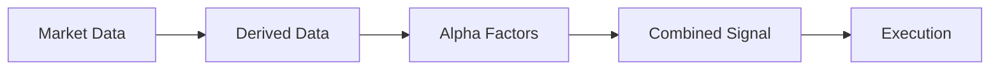

# 信号生成 (Signal Generation)

在量化交易中，信号（Signal）是策略决策的输入。它将海量的、嘈杂的市场数据（Market Data）提炼为具有预测能力的指标。

HFT 的信号生成有两个显著特点：
1.  **极低延迟**: 必须在纳秒级完成计算。
2.  **增量更新 (Incremental Updates)**: 不能每次都重算整个历史窗口，必须利用上一次的计算结果。

## 1. 信号流水线 (Signal Pipeline)



*   **Derived Data**: 中间价 (Mid Price), 订单簿不平衡 (Imbalance), 加权均价 (VWAP)。
*   **Alpha Factors**: 动量 (Momentum), 均值回归 (Mean Reversion), 波动率 (Volatility)。
*   **Combined Signal**: 多因子加权打分。

## 2. 增量计算 (Incremental Calculation)

### 2.1 指数移动平均 (EMA)
EMA 是最适合 HFT 的指标，因为它不需要维护历史窗口，只需要上一个值。

$$ EMA_t = \alpha \times Price_t + (1 - \alpha) \times EMA_{t-1} $$

```rust
pub struct Ema {
    alpha: f64,
    // 预计算 (1 - alpha) 以减少一次减法指令
    one_minus_alpha: f64,
    value: f64,
    initialized: bool,
}

impl Ema {
    pub fn new(alpha: f64) -> Self {
        Self {
            alpha,
            one_minus_alpha: 1.0 - alpha,
            value: 0.0,
            initialized: false,
        }
    }

    #[inline(always)]
    pub fn update(&mut self, price: f64) -> f64 {
        if !self.initialized {
            self.value = price;
            self.initialized = true;
        } else {
            // FMA (Fused Multiply-Add) 指令优化
            // value = alpha * price + (1-alpha) * value
            self.value = price.mul_add(self.alpha, self.value * self.one_minus_alpha);
        }
        self.value
    }
}
```

### 2.2 滑动窗口 (Sliding Window)
对于简单移动平均 (SMA) 或最大/最小值，我们需要维护一个窗口。
**Ring Buffer** 是最佳选择。

```rust
pub struct SlidingWindowSum {
    window: Vec<f64>, // 或使用 const generics [f64; N]
    head: usize,
    sum: f64,
    capacity: usize,
}

impl SlidingWindowSum {
    pub fn update(&mut self, new_val: f64) -> f64 {
        let old_val = self.window[self.head];
        self.window[self.head] = new_val;
        
        // 增量更新 Sum: Sum_new = Sum_old - x_out + x_in
        self.sum = self.sum - old_val + new_val;
        
        self.head = (self.head + 1) % self.capacity;
        self.sum
    }
}
```
**注意**: 浮点数累加 `sum` 可能会产生精度漂移 (Catastrophic Cancellation)。建议每隔 N 次 update 重新全量求和一次 (Re-normalization)。

## 3. 复杂信号优化：线性回归 (Linear Regression)

假设我们需要计算价格关于时间的斜率（Slope）。
$$ y = kx + b $$
使用最小二乘法，可以在 $O(1)$ 时间内更新斜率。我们需要维护四个累加和：
*   $\sum x$, $\sum y$, $\sum x^2$, $\sum xy$

当新数据点进入、旧数据点移出时，更新这 4 个 Sum 即可直接算出 $k$ 和 $b$。

## 4. SIMD 加速

如果需要同时计算 4 个不同周期的 EMA，或者为 4 个不同的 Symbol 计算同一个指标，可以使用 SIMD (Single Instruction Multiple Data)。

```rust
#![feature(portable_simd)]
use std::simd::{f64x4, Simd};

pub struct SimdEma4 {
    alphas: f64x4,
    one_minus_alphas: f64x4,
    values: f64x4,
}

impl SimdEma4 {
    pub fn new(alphas: [f64; 4]) -> Self {
        let alphas = f64x4::from_array(alphas);
        let one = f64x4::splat(1.0);
        Self {
            alphas,
            one_minus_alphas: one - alphas,
            values: f64x4::splat(0.0),
        }
    }

    #[inline(always)]
    pub fn update(&mut self, prices: f64x4) -> f64x4 {
        // 并行计算 4 个 EMA
        // value = price * alpha + value * (1 - alpha)
        self.values = prices * self.alphas + self.values * self.one_minus_alphas;
        self.values
    }
}
```

## 5. 信号合成与归一化 (Composition & Normalization)

原始信号（如价格差）的量纲各异，通常需要归一化为 Z-Score：
$$ Z = \frac{x - \mu}{\sigma} $$

其中 $\mu$ 和 $\sigma$ 也可以使用增量算法（Welford's Online Algorithm）实时更新。

最终的交易信号通常是多个因子的加权和：
```rust
#[inline(always)]
fn combine_signals(factors: &[f64], weights: &[f64]) -> f64 {
    // 自动向量化友好
    factors.iter().zip(weights).map(|(f, w)| f * w).sum()
}
```

通过预计算权重和因子布局（SoA），这个操作可以在极少的 CPU 周期内完成。
