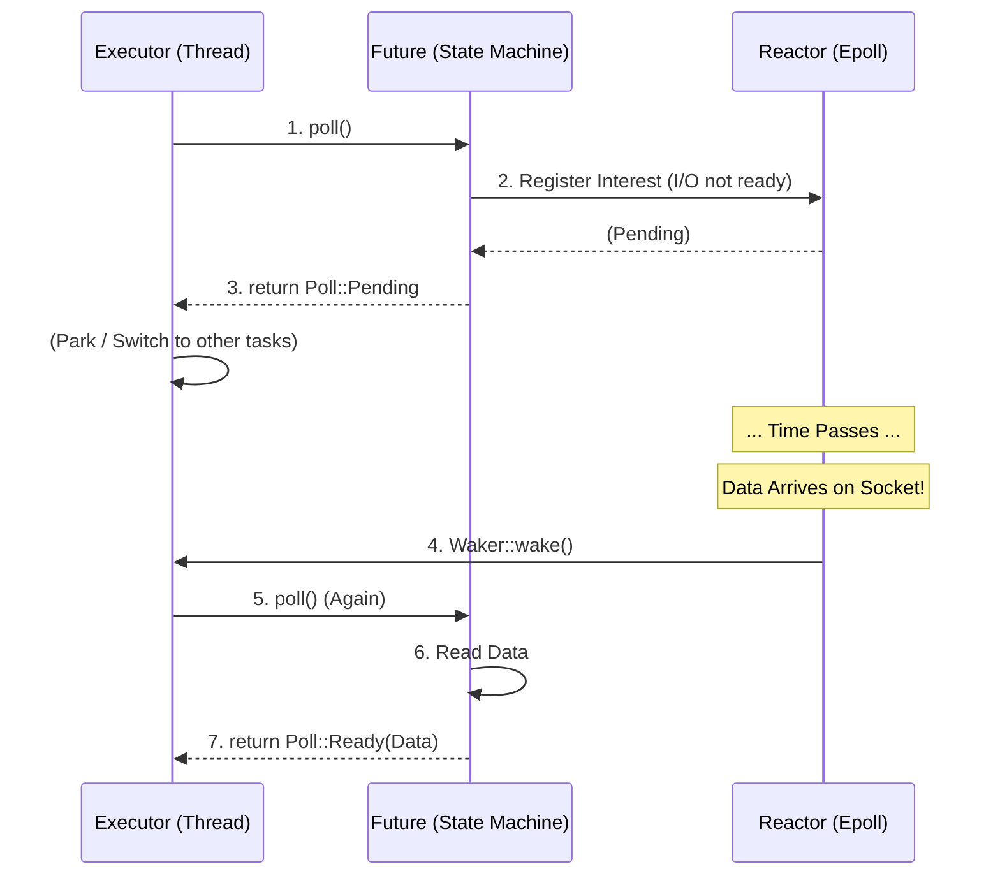
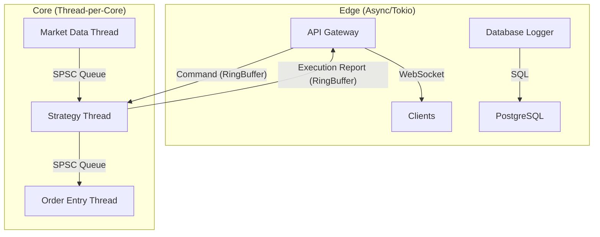

# Async Rust 原理与 Tokio (Async Rust & Tokio)

在上一章中，我们对比了 Thread-per-Core 和 Async 模型。尽管 HFT 的核心交易逻辑倾向于避免使用 `async`，但现代交易系统是一个复杂的异构体。网关 (Gateways)、WebSockets 行情接入、数据库日志归档等**非关键路径**组件，仍然大量依赖 Rust 强大的异步生态。

本章将深入剖析 Rust 的异步原理及 Tokio 运行时，帮助你在系统中做出正确的架构决策。

## 1. 异步原理：零成本抽象的真相

Rust 的 `async/await` 经常被标榜为“零成本抽象”。这在内存使用上是正确的（状态机大小在编译期确定），但在运行时开销上并非如此。

### 1.1 Future 与状态机 (State Machines)

当你编写一个 `async fn` 时，编译器会通过 **Generator（生成器）** 变换，将其重写为一个实现了 `Future` trait 的状态机枚举 (Enum)。

#### 为什么是状态机？

想象一下，如果让你手动写异步代码，你会怎么做？你需要把函数的执行过程切分成好几段：
1.  第一段：发起连接，然后返回。
2.  第二段（回调）：连接成功了，发起读取，然后返回。
3.  第三段（回调）：读取完成了，解析数据。

Rust 的编译器就是帮你做了这件事。它扫描你的 `async fn`，在每一个 `await` 点（Yield Point）把函数“切断”。

*   `await` 之前的所有局部变量，必须保存下来，放入一个结构体（状态 1）。
*   `await` 之后的所有局部变量，也需要保存，放入另一个结构体（状态 2）。

最终，这些结构体被包装进一个巨大的 `Enum` 中。

```rust
// 源代码
async fn fetch_order() -> Order {
    // --- 状态 0: Start ---
    let socket = TcpStream::connect("127.0.0.1:8080").await; // <--- 切割点 1
    
    // --- 状态 1: WaitingConnect ---
    // socket 必须被保存，因为下面的代码要用它
    let mut buf = [0u8; 1024];
    socket.read(&mut buf).await;                             // <--- 切割点 2
    
    // --- 状态 2: WaitingRead ---
    // buf 必须被保存
    parse(buf)
}

// 编译器生成的伪代码 (简化版)
enum FetchOrderFuture {
    // 刚开始，什么都没有
    Start,
    
    // 等待连接：保存了 connect 返回的子 Future
    WaitingConnect {
        future: TcpStreamFuture, 
    },
    
    // 等待读取：连接好了，socket 和 buf 都要活着
    WaitingRead {
        socket: TcpStream,       // 跨越 await 的变量
        buf: [u8; 1024],         // 跨越 await 的变量
        future: ReadFuture,
    },
    
    // 结束
    Done,
}

impl Future for FetchOrderFuture {
    type Output = Order;

    // 唯一的入口：poll
    fn poll(mut self: Pin<&mut Self>, cx: &mut Context<'_>) -> Poll<Self::Output> {
        loop {
            match *self {
                // 1. 初始状态：还没开始连接
                FetchOrderFuture::Start => {
                    // 发起 TCP 连接（这是一个非阻塞操作，会立即返回一个 Future）
                    let fut = TcpStream::connect("127.0.0.1:8080");
                    // 状态流转：保存这个子 Future，进入下一个状态
                    *self = FetchOrderFuture::WaitingConnect { future: fut };
                    // continue loop，立即尝试 poll 这个新状态，看连接是否已经瞬间完成了
                }

                // 2. 等待连接完成
                FetchOrderFuture::WaitingConnect { ref mut future } => {
                    // 驱动子 Future (connect)
                    // 注意：这里我们把 cx 传下去了，这样 connect 里的 Reactor 才能拿到 Waker
                    match future.poll(cx) {
                        Poll::Ready(socket) => {
                            // 连接成功！准备读取
                            let mut buf = [0u8; 1024];
                            // 发起读取操作（同样是非阻塞的）
                            let read_fut = socket.read(&mut buf);
                            // 状态流转：保存 socket、buf 和读取任务
                            *self = FetchOrderFuture::WaitingRead { 
                                socket, 
                                buf, 
                                future: read_fut 
                            };
                            // continue loop，立即尝试 poll 读取任务
                        }
                        Poll::Pending => {
                            // 连接还没好。
                            // Waker 已经被注册在 Reactor 里了。
                            // 我们只能返回 Pending，把 CPU 让给别的任务。
                            return Poll::Pending;
                        }
                    }
                }

                // 3. 等待读取完成
                FetchOrderFuture::WaitingRead { ref mut future, ref buf, .. } => {
                    match future.poll(cx) {
                        Poll::Ready(_) => {
                            // 读取完成！解析数据
                            let order = parse(buf);
                            *self = FetchOrderFuture::Done;
                            // 任务彻底完成，返回结果
                            return Poll::Ready(order);
                        }
                        Poll::Pending => return Poll::Pending,
                    }
                }

                FetchOrderFuture::Done => panic!("Future polled after completion"),
            }
        }
    }
}
```

**为什么 `poll` 里面要有个 `loop`？**
这是一个经典的面试题，也是 HFT 优化的关键点。
如果 `connect` 能够瞬间完成（例如连接本地 socket），它会直接返回 `Ready`。如果没有 `loop`，我们会返回 `Pending`，然后 Executor 会再次调度我们。这会产生一次不必要的上下文切换（Yield）。
通过 `loop`，只要子任务返回 `Ready`，我们就立即推进到下一个状态，**尽可能一口气跑完所有能跑的代码**，直到真正遇到阻塞（I/O 未就绪）为止。这就是所谓的“Run to completion (as much as possible)”。

**关键推论**:
1.  **零堆内存分配**: 这个 `Enum` 的大小在编译期就确定了（等于最大的那个变体）。它可以完全分配在栈上！这与 Java/Go/Python 需要为每个协程分配堆栈不同。
2.  **跨越 await 的变量**: 只有那些**跨越**了 `await` 点的变量才会被捕获进结构体。如果你在两个 `await` 之间定义并使用了一个大数组，它不会占用 Future 的大小。

### 1.2 递归状态机：洋葱模型

你可能会问：**“子 Future 也有自己的状态机吗？”**

是的。`TcpStream::connect` 返回的 `ConnectFuture` 内部也是一个状态机。
`FetchOrderFuture` 就像一个**洋葱**，它包裹着 `ConnectFuture`，而 `ConnectFuture` 可能包裹着更底层的 `IOFuture`。

当我们调用最外层的 `poll` 时，实际上发生了一次**递归调用链**：

1.  Executor 调用 `FetchOrderFuture::poll()`。
2.  `FetchOrderFuture` 发现自己正处于 `WaitingConnect` 状态，于是调用内部 `ConnectFuture::poll()`。
3.  `ConnectFuture` 发现 socket 还没就绪，于是调用最底层的 `Mio::poll()` 注册 Interest。

**Magic**:
虽然逻辑上是递归调用的，但在**内存布局**上，Rust 编译器极其聪明地将这些层层嵌套的 Future **展平 (Flatten)** 了。
`FetchOrderFuture` 的 `size_of` 等于它所有子 Future 中最大的那个变体的大小。这意味着整个异步任务栈（Task Stack）被压缩成了一个单一的结构体，完全分配在栈上（或一次性 Box 到堆上）。

这与 Go/Java 不同，它们真的需要动态分配栈帧。Rust 的做法是**零内存分配**的极致体现。

#### HFT 视角分析

*   **内存布局**: 整个 Future 是一个紧凑的结构体，对 Cache 友好。
*   **分支预测**: `poll` 方法本质上是一个巨大的 `match` (switch-case)。频繁的状态切换可能导致 CPU 分支预测失败。
*   **函数调用开销**: 每次 `poll` 都是一次虚函数调用（通过 VTable 的 `Waker`）或者动态分发，虽然 Rust 极力优化，但在纳秒级尺度上仍有成本。

### 1.2 Waker 与 Reactor

Rust 的异步模型是 **Reactor-Executor** 模式的典型实现，但初学者往往会混淆各个组件的角色。让我们用 HFT 的术语来重新解释：

*   **Future (任务)**: 相当于一个“回调函数”的容器。它包含了自己的状态（读到哪了、写了多少）。
*   **Executor (调度器)**: 相当于一个 `while loop`。它不断地从队列里取出 Future，调用它们的 `poll` 方法。
*   **Reactor (驱动器)**: 相当于 `epoll_wait` 的封装。它负责监听文件描述符（FD）的事件。
*   **Waker (唤醒器)**: 这是一个至关重要的**桥梁**。当 I/O 未就绪时，Future 会把 Waker 扔给 Reactor 说：“等有数据了，用这个叫醒我”。

**完整流程图解**:



**关键点**:
Rust 的 Future 是 **惰性 (Lazy)** 的。如果你创建了一个 Future 但不 `await` (或 `spawn`) 它，它**什么都不会做**。这与 Java/Go 的 Hot Future 不同。

### 1.3 为什么 `Waker` 如此昂贵？

在 HFT 中，我们讨厌 `Waker`，因为它涉及：
1.  **动态分发 (Dynamic Dispatch)**: `Waker` 本质上是一个 VTable 指针（为了擦除具体的 Executor 类型）。调用 `wake()` 就是一次虚函数调用。
2.  **原子操作 (Atomics)**: 为了线程安全，`Waker` 通常被 `Arc` 包裹，克隆和释放都涉及原子引用计数。
3.  **调度开销**: `wake()` 通常意味着将任务推入全局或本地队列，这涉及锁（或无锁队列的 CAS 操作）。

这就是为什么在纳秒级网关中，我们宁愿用 `while !ready { cpu_relax(); }` 也不愿用 `await`。

## 2. Tokio 运行时深度解析

Tokio 是 Rust 事实上的标准异步运行时。它包含两个核心组件：**Executor (调度器)** 和 **Reactor (驱动器)**。

### 2.1 多核调度原理：Task 与 Worker

你可能会问：**“既然 Future 只是个被动的状态机，它是怎么利用 64 核 CPU 的？”**

答案在于 **Executor**。Future 只是定义了“做什么”，Executor 决定“在哪做”。

*   **Task (任务)**: 当你调用 `tokio::spawn(my_future)` 时，Tokio 会把这个 Future 包装成一个 **Task**。Task 是调度的基本单位。
*   **Worker (工人)**: Tokio 启动 N 个系统线程（通常等于 CPU 核心数），每个线程称为一个 Worker。
*   **M:N 映射**: 你可能有 100 万个 Task (M)，但只有 16 个 Worker (N)。Worker 只要有空，就会从队列里拿一个 Task 来执行（调用 `poll`）。

**Send 约束的由来**:
因为 Task 可能会被调度到任意一个 Worker 线程上执行，甚至在执行过程中被“偷”到另一个线程（见下文），所以 Rust 强制要求：
**所有跨越 `await` 点的变量，其类型必须实现 `Send` Trait。**
这保证了数据在线程间转移是安全的。

### 2.2 工作窃取调度器 (Work-Stealing Scheduler)

Tokio 的多线程运行时 (`rt-multi-thread`) 使用工作窃取算法：
*   每个 worker 线程维护一个本地双端队列 (Local Deque)。
*   任务优先被推入本地队列，并在该线程上执行（LIFO 模式，利用热 Cache）。
*   当本地队列为空时，线程会尝试从其他线程的队列尾部“窃取”任务。

**HFT 的隐患**:
*   **跨核迁移 (Migration)**: 任务可能在一个核心开始，在另一个核心结束。这会彻底破坏 L1/L2 Cache 局部性。
*   **延迟抖动**: 窃取操作涉及原子操作 (CAS) 和锁竞争，可能引入微秒级的延迟。

### 2.3 协作式调度与饥饿

Tokio 是**协作式 (Cooperative)** 的。如果一个 `async` 任务执行了密集的 CPU 计算而不 `await`，它将霸占线程，导致其他 I/O 任务（如心跳包处理）饿死。

```rust
// 错误示范：在 async 中做计算
async fn heavy_computation() {
    // 这会阻塞当前 worker 线程 100ms！
    // 导致同线程的其他 Future 无法被调度。
    let start = Instant::now();
    while start.elapsed() < Duration::from_millis(100) {
        // ...
    }
}
```

**解决方案**:
*   `tokio::task::yield_now().await`: 主动让出 CPU。
*   `tokio::task::spawn_blocking`: 将计算扔到专用的阻塞线程池。

## 3. HFT 系统中的混合架构 (Hybrid Architecture)

在 HFT 中，我们通常采用 **混合架构**：边缘用 Async，核心用 Sync。

### 3.1 架构图



### 3.2 适用场景指南

| 组件 | 推荐模型 | 原因 |
| :--- | :--- | :--- |
| **策略逻辑 (Strategy)** | **Thread-per-Core** | 必须保证 Cache Hot，零调度延迟，指令级确定性。 |
| **行情解码 (Feed Handler)** | **Thread-per-Core** | UDP 组播量大，必须忙轮询 (Busy Poll) 以避免丢包。 |
| **订单发送 (Order Entry)** | **Thread-per-Core** | TCP 发送通常非阻塞，但为了极致延迟，不应由调度器决定何时发送。 |
| **Web 监控台 (Dashboard)** | **Async (Tokio)** | 处理大量并发 WebSocket 连接，吞吐量优先。 |
| **历史数据落库** | **Async (Tokio)** | 磁盘 I/O 慢，不需要占用核心线程。 |
| **REST API 接口** | **Async (Tokio)** | HTTP 请求天然适合 Request-Response 模型。 |

## 4. 实战：在 HFT 中正确使用 Tokio

如果你必须在关键路径附近使用 Tokio，请遵循以下原则：

### 4.1 使用单线程运行时 (`current_thread`)

避免使用 `#[tokio::main]` (默认是多线程)。显式配置单线程运行时，将其绑定到非关键核心。

```rust
fn main() {
    let rt = tokio::runtime::Builder::new_current_thread() // 关键：单线程
        .enable_all()
        .build()
        .unwrap();

    rt.block_on(async {
        // 这里的任务永远不会跨核迁移
        // 且没有多线程同步开销
    });
}
```

### 4.2 避免 `std::sync::Mutex`

在 `async` 代码中持有标准库的 `Mutex` 跨越 `await` 点是危险的，会导致死锁。

*   **原则**: 尽量不共享状态。
*   **替代**: 使用 `tokio::sync::mpsc` 通道传递消息，或者 `tokio::sync::Mutex` (仅在不得不共享且临界区很短时)。

### 4.3 预分配与零拷贝

Tokio 的 I/O 接口 (`AsyncRead`, `AsyncWrite`) 通常需要缓冲区。避免在循环中反复 `vec![0; 1024]`。

```rust
// 推荐：复用缓冲区
let mut buf = BytesMut::with_capacity(4096);
loop {
    stream.read_buf(&mut buf).await?;
    // 处理...
    buf.clear(); // 保留容量，重置指针
}
```

---

**总结**: Tokio 是 Rust 生态的瑰宝，但在 HFT 的**核心路径 (Critical Path)** 上，它是一个因为过于通用而显得“笨重”的工具。请将它限制在系统的边缘（网关、日志、监控），把 CPU 的每一个周期都留给核心策略逻辑。
