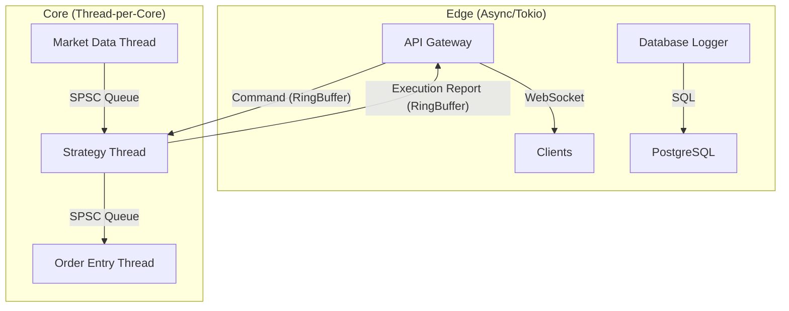

# Async Rust 原理与 Tokio (Async Rust & Tokio)

在上一章中，我们对比了 Thread-per-Core 和 Async 模型。尽管 HFT 的核心交易逻辑倾向于避免使用 `async`，但现代交易系统是一个复杂的异构体。网关 (Gateways)、WebSockets 行情接入、数据库日志归档等**非关键路径**组件，仍然大量依赖 Rust 强大的异步生态。

本章将深入剖析 Rust 的异步原理及 Tokio 运行时，帮助你在系统中做出正确的架构决策。

## 1. 异步原理：零成本抽象的真相

Rust 的 `async/await` 经常被标榜为“零成本抽象”。这在内存使用上是正确的（状态机大小在编译期确定），但在运行时开销上并非如此。

### 1.1 Future 与状态机 (State Machines)

当你编写一个 `async fn` 时，编译器会将其转换为一个实现了 `Future` trait 的状态机枚举 (Enum)。

```rust
// 源代码
async fn fetch_order() -> Order {
    let socket = TcpStream::connect("127.0.0.1:8080").await;
    let mut buf = [0u8; 1024];
    socket.read(&mut buf).await;
    parse(buf)
}

// 编译器生成的伪代码 (简化版)
enum FetchOrderFuture {
    Start,
    WaitingConnect(TcpStreamFuture),
    WaitingRead(TcpStream, [u8; 1024], ReadFuture),
    Done,
}

impl Future for FetchOrderFuture {
    type Output = Order;
    fn poll(mut self: Pin<&mut Self>, cx: &mut Context<'_>) -> Poll<Self::Output> {
        loop {
            match self {
                Start => {
                    // 发起连接
                    let fut = TcpStream::connect(...);
                    self = WaitingConnect(fut);
                }
                WaitingConnect(ref mut fut) => {
                    match fut.poll(cx) {
                        Poll::Ready(socket) => {
                            // 连接成功，发起读取
                            let buf = [0u8; 1024];
                            let read_fut = socket.read(&mut buf);
                            self = WaitingRead(socket, buf, read_fut);
                        }
                        Poll::Pending => return Poll::Pending, // 让出 CPU
                    }
                }
                // ...
            }
        }
    }
}
```

**HFT 视角分析**:
*   **内存布局**: 整个 Future 的大小是所有状态中最大的那个。这通常意味着它是一个紧凑的结构体，对 Cache 友好。
*   **分支预测**: `poll` 方法本质上是一个巨大的 `match` (switch-case)。频繁的状态切换可能导致 CPU 分支预测失败。
*   **函数调用开销**: 每次 `poll` 都是一次虚函数调用（通过 VTable 的 `Waker`）或者动态分发，虽然 Rust 极力优化，但在纳秒级尺度上仍有成本。

### 1.2 Waker 与 Reactor

Rust 的异步是**基于轮询 (Poll-based)** 的，但不是**忙轮询 (Busy Poll)**。它依赖 `Waker` 机制来通知 Executor “我现在准备好了”。

1.  Executor 调用 `Future::poll`。
2.  Future 发现 I/O 未就绪，注册一个 `Waker` 到 Reactor (Epoll)，并返回 `Poll::Pending`。
3.  Executor 挂起该任务，去运行其他任务。
4.  当网卡收到数据，中断触发 Epoll 事件。
5.  Reactor 调用 `Waker::wake()`。
6.  Executor 将该任务放回就绪队列 (Run Queue)，并在下次循环中再次 `poll` 它。

## 2. Tokio 运行时深度解析

Tokio 是 Rust 事实上的标准异步运行时。它包含两个核心组件：**Executor (调度器)** 和 **Reactor (驱动器)**。

### 2.1 工作窃取调度器 (Work-Stealing Scheduler)

Tokio 的多线程运行时 (`rt-multi-thread`) 使用工作窃取算法：
*   每个 worker 线程维护一个本地双端队列 (Local Deque)。
*   任务优先被推入本地队列，并在该线程上执行（LIFO 模式，利用热 Cache）。
*   当本地队列为空时，线程会尝试从其他线程的队列尾部“窃取”任务。

**HFT 的隐患**:
*   **跨核迁移 (Migration)**: 任务可能在一个核心开始，在另一个核心结束。这会彻底破坏 L1/L2 Cache 局部性。
*   **延迟抖动**: 窃取操作涉及原子操作 (CAS) 和锁竞争，可能引入微秒级的延迟。

### 2.2 协作式调度与饥饿

Tokio 是**协作式 (Cooperative)** 的。如果一个 `async` 任务执行了密集的 CPU 计算而不 `await`，它将霸占线程，导致其他 I/O 任务（如心跳包处理）饿死。

```rust
// 错误示范：在 async 中做计算
async fn heavy_computation() {
    // 这会阻塞当前 worker 线程 100ms！
    // 导致同线程的其他 Future 无法被调度。
    let start = Instant::now();
    while start.elapsed() < Duration::from_millis(100) {
        // ...
    }
}
```

**解决方案**:
*   `tokio::task::yield_now().await`: 主动让出 CPU。
*   `tokio::task::spawn_blocking`: 将计算扔到专用的阻塞线程池。

## 3. HFT 系统中的混合架构 (Hybrid Architecture)

在 HFT 中，我们通常采用 **混合架构**：边缘用 Async，核心用 Sync。

### 3.1 架构图



### 3.2 适用场景指南

| 组件 | 推荐模型 | 原因 |
| :--- | :--- | :--- |
| **策略逻辑 (Strategy)** | **Thread-per-Core** | 必须保证 Cache Hot，零调度延迟，指令级确定性。 |
| **行情解码 (Feed Handler)** | **Thread-per-Core** | UDP 组播量大，必须忙轮询 (Busy Poll) 以避免丢包。 |
| **订单发送 (Order Entry)** | **Thread-per-Core** | TCP 发送通常非阻塞，但为了极致延迟，不应由调度器决定何时发送。 |
| **Web 监控台 (Dashboard)** | **Async (Tokio)** | 处理大量并发 WebSocket 连接，吞吐量优先。 |
| **历史数据落库** | **Async (Tokio)** | 磁盘 I/O 慢，不需要占用核心线程。 |
| **REST API 接口** | **Async (Tokio)** | HTTP 请求天然适合 Request-Response 模型。 |

## 4. 实战：在 HFT 中正确使用 Tokio

如果你必须在关键路径附近使用 Tokio，请遵循以下原则：

### 4.1 使用单线程运行时 (`current_thread`)

避免使用 `#[tokio::main]` (默认是多线程)。显式配置单线程运行时，将其绑定到非关键核心。

```rust
fn main() {
    let rt = tokio::runtime::Builder::new_current_thread() // 关键：单线程
        .enable_all()
        .build()
        .unwrap();

    rt.block_on(async {
        // 这里的任务永远不会跨核迁移
        // 且没有多线程同步开销
    });
}
```

### 4.2 避免 `std::sync::Mutex`

在 `async` 代码中持有标准库的 `Mutex` 跨越 `await` 点是危险的，会导致死锁。

*   **原则**: 尽量不共享状态。
*   **替代**: 使用 `tokio::sync::mpsc` 通道传递消息，或者 `tokio::sync::Mutex` (仅在不得不共享且临界区很短时)。

### 4.3 预分配与零拷贝

Tokio 的 I/O 接口 (`AsyncRead`, `AsyncWrite`) 通常需要缓冲区。避免在循环中反复 `vec![0; 1024]`。

```rust
// 推荐：复用缓冲区
let mut buf = BytesMut::with_capacity(4096);
loop {
    stream.read_buf(&mut buf).await?;
    // 处理...
    buf.clear(); // 保留容量，重置指针
}
```

---

**总结**: Tokio 是 Rust 生态的瑰宝，但在 HFT 的**核心路径 (Critical Path)** 上，它是一个因为过于通用而显得“笨重”的工具。请将它限制在系统的边缘（网关、日志、监控），把 CPU 的每一个周期都留给核心策略逻辑。
