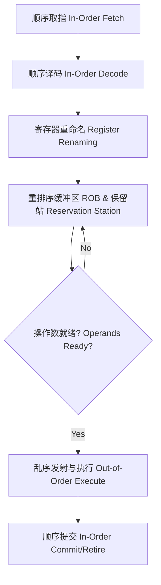

# 第2章：CPU 微架构原理与低延迟优化 (CPU Microarchitecture and Low-Latency Optimization)

在设计和实现纳秒级延迟的交易系统时，仅仅理解编程语言的语法与抽象是远远不够的。软件的本质是驱动硬件状态的变迁。为了在现代复杂处理器上获得极致且确定的性能，开发者必须深刻理解 CPU 的微架构（Microarchitecture）设计。

本章将从计算机体系结构的核心概念出发，系统探讨指令流水线（Instruction Pipeline）、分支预测（Branch Prediction）、乱序执行（Out-of-Order Execution）以及硬件级高精度计时（Hardware Timers）的底层原理，并展示如何通过 Rust 编写与硬件高度契合的低延迟代码。

## 2.1 指令级并行与流水线架构 (Instruction-Level Parallelism and Pipelining)

现代处理器的核心性能提升手段之一是指令级并行（Instruction-Level Parallelism, ILP），它主要通过两个维度实现：时间维度上的流水线技术（Pipelining）与空间维度上的超标量架构（Superscalar）。

### 2.1.1 经典流水线模型与数据冒险 (Pipeline Model and Data Hazards)

指令的执行过程在微架构层面通常被划分为多个离散的阶段。以经典的五级流水线为例，一条指令的生命周期包括：取指（Fetch, IF）、译码（Decode, ID）、执行（Execute, EX）、访存（Memory, MEM）和写回（Writeback, WB）。

```mermaid
gantt
    title 五级指令流水线的时间并行模型 (Pipelined Execution)
    dateFormat  X
    axisFormat %s
    section 指令 1 (A = 10)
    IF :a1, 0, 1
    ID :a2, 1, 2
    EX :a3, 2, 3
    MEM :a4, 3, 4
    WB :a5, 4, 5
    section 指令 2 (B = A + 5)
    IF :b1, 1, 2
    ID :b2, 2, 3
    Stall (气泡) :crit, b3, 3, 4
    EX :b4, 4, 5
    MEM :b5, 5, 6
    WB :b6, 6, 7
```



虽然流水线通过重叠指令的执行阶段显著提升了吞吐量（Throughput），但它极易受到**数据冒险（Data Hazards）**的干扰。当后一条指令（如上述图表中的指令 2）的执行依赖于前一条指令（指令 1）尚未写回的结果时，流水线必须暂停（Stall），从而产生流水线气泡（Pipeline Bubble），导致 CPU 周期的浪费。

### 2.1.2 超标量架构与循环展开 (Superscalar Architecture and Loop Unrolling)

为了突破流水线单个时钟周期最多完成一条指令（IPC ≤ 1）的理论极限，现代 CPU 引入了超标量架构。在执行阶段（EX），CPU 配备了多套功能单元（如多个 ALU 整数运算单元、FPU 浮点运算单元）。这意味着在没有数据依赖的前提下，CPU 可以在同一个时钟周期内发射并执行多条指令。

在工程实践中，**循环展开（Loop Unrolling）** 是充分利用超标量架构的经典技术。

```rust
// 代码清单 2.1：通过循环展开打破依赖链，提升 IPC

/// 普通累加：由于每次迭代都强依赖上一次的 `acc` 结果，
/// 数据依赖链导致 CPU 只能串行执行加法，大量 ALU 处于空闲状态。
pub fn sum_sequential(data: &[u32]) -> u32 {
    let mut acc = 0;
    for &val in data {
        acc += val;
    }
    acc
}

/// 循环展开（4路）：打破了单一的依赖链。
/// 此时 acc1, acc2, acc3, acc4 的计算是相互独立的。
/// 超标量 CPU 会将这 4 个加法操作分配到不同的 ALU 上并行执行。
pub fn sum_unrolled(data: &[u32]) -> u32 {
    let mut acc1 = 0;
    let mut acc2 = 0;
    let mut acc3 = 0;
    let mut acc4 = 0;
    
    // 假设 data 的长度是 4 的倍数
    let mut iter = data.chunks_exact(4);
    for chunk in iter {
        acc1 += chunk[0];
        acc2 += chunk[1];
        acc3 += chunk[2];
        acc4 += chunk[3];
    }
    
    acc1 + acc2 + acc3 + acc4
}
```

**代码解析**：
在 `sum_unrolled` 中，通过引入多个独立的累加器变量，我们在软件层面消除了控制流中的串行数据依赖（Read-After-Write, RAW）。这使得编译器和 CPU 的指令调度器能够将这些不相关的加法指令并行发射，显著提升 IPC，降低总体计算延迟。

## 2.2 控制流冒险与分支预测机制 (Control Flow Hazards and Branch Prediction)

除了数据依赖，流水线面临的最严重威胁是控制冒险（Control Hazards），主要由条件分支指令（如 `if` 语句对应的机器码）引起。

### 2.2.1 预测惩罚的代价 (Misprediction Penalty)

当取指单元（Fetch Unit）遇到条件跳转指令时，分支条件的计算结果通常需要数个周期后才能在执行单元（EX）中得出。为了防止流水线停顿，现代 CPU 必须使用**分支预测器（Branch Predictor）**猜测未来的执行路径，并进行推测执行（Speculative Execution）。

如果预测失败（Misprediction），CPU 必须丢弃所有在错误路径上推测执行的指令（即清空流水线，Pipeline Flush），并从正确的地址重新取指。在现代拥有十几至二十几级深度的流水线架构中，一次分支预测失败通常会导致 15 到 20 个时钟周期的极高惩罚。

### 2.2.2 工程实践：无分支编程 (Branchless Programming)

在核心交易循环中，对于概率分布不可预测的条件分支，最佳策略是通过位运算或算术运算彻底消除条件跳转指令，这种技术被称为**无分支编程**。

```rust
// 代码清单 2.2：消除条件分支以保证确定性延迟

/// 传统的分支实现
/// 汇编通常包含 CMP (比较) 和 JNE/JE (条件跳转)
pub fn process_order_branched(price: i32) -> i32 {
    if price > 0 {
        1
    } else {
        0
    }
}

/// 无分支实现 (Branchless)
/// 汇编中没有任何跳转指令，通常编译为 SETG 等指令
pub fn process_order_branchless(price: i32) -> i32 {
    (price > 0) as i32
}
```

**代码解析**：
`process_order_branchless` 利用了 Rust 中布尔类型安全转换为整数的特性。编译器通常会将其优化为直接的寄存器操作（如利用比较指令的标志位）。虽然这种做法在某些情况下可能比预测正确的分支多执行一两条简单的算术指令，但它彻底消除了预测失败带来的 20 个周期惩罚，从而极大地降低了尾部延迟（Tail Latency）的抖动。

### 2.2.3 编译器提示 (Compiler Hints)

对于那些具有极高预测确定性（例如错误处理路径）的分支，我们可以通过提示编译器来优化指令缓存（I-Cache）的局部性。

```rust
// 代码清单 2.3：使用 cold 属性优化冷路径

#[inline(always)]
pub fn fast_path_logic() { /* ... */ }

#[cold]
#[inline(never)]
pub fn handle_fatal_error() {
    // 发生严重错误时的慢速恢复逻辑
}

pub fn process_data(is_valid: bool) {
    if is_valid {
        fast_path_logic();
    } else {
        handle_fatal_error();
    }
}
```

**代码解析**：
`#[cold]` 属性向 Rust 编译器及 LLVM 后端传递了强烈的静态分支概率信号。编译器不仅会将 `is_valid` 假设为 `true`，还会将 `handle_fatal_error` 的机器码放置在内存的远端区域（Out-of-line）。这保证了热路径（Hot Path）的机器码紧凑地排列在一起，最大化了 L1 指令缓存的命中率。

## 2.3 乱序执行引擎 (Out-of-Order Execution Engine)

为了掩盖主存访问（DRAM Access）带来的巨大延迟（通常高达 200-300 个时钟周期），现代高端处理器采用了基于 Tomasulo 算法的乱序执行（Out-of-Order Execution, OoO）架构。

CPU 在译码阶段后，会将指令放入**重排序缓冲区（Reorder Buffer, ROB）**。调度器（Scheduler）会持续扫描 ROB，一旦发现某条指令的操作数已经准备就绪（即使它在程序顺序中位于后面），就会立即将其发射到执行单元。



**架构意义**：
虽然乱序执行是硬件自动完成的，但作为底层开发者，我们需要确保代码中存在足够的**指令间独立性**。如果代码中存在冗长且严格串行的数据依赖链，ROB 很快就会被阻塞的指令填满，导致整个乱序引擎停顿（Stall）。

## 2.4 微秒级硬件精确计时：TSC (Time Stamp Counter)

在高频交易中，性能剖析（Profiling）通常需要测量纳秒（ns）级别的代码执行时间。标准的操作系统调用（如 `std::time::Instant::now()` 底层调用的 `clock_gettime`）即使经过 vDSO 优化，仍可能引入 20-50 纳秒的开销与上下文切换抖动。这对于评估耗时仅数十纳秒的热路径是不可接受的。

### 2.4.1 RDTSC 指令与序列化 (RDTSC and Serialization)

x86_64 架构提供了一个名为 TSC（Time Stamp Counter）的 64 位硬件寄存器，它记录了自处理器复位以来的时钟周期数。读取该寄存器的 `rdtsc` 指令仅需不到 10 纳秒的开销。

然而，由于上述提到的**乱序执行引擎**，普通的 `rdtsc` 指令可能会被 CPU 重排（Reorder）到被测代码段的中间甚至后面执行，从而导致测量结果严重失真。因此，必须结合序列化指令（Serializing Instructions）或内存屏障（Memory Barriers），或者使用自带序列化语义的 `rdtscp` 指令。

```rust
// 代码清单 2.4：Rust 中高精度的硬件计时器封装

#[cfg(target_arch = "x86_64")]
pub mod hardware_timer {
    use std::arch::x86_64::{_rdtsc, _rdtscp};

    /// 在代码块开始前读取时间戳。
    /// 使用 LFENCE 充当轻量级指令屏障，防止乱序执行导致后续指令被提前执行。
    #[inline(always)]
    pub fn start_tsc() -> u64 {
        unsafe {
            std::arch::asm!("lfence", options(nostack, nomem, preserves_flags));
            _rdtsc()
        }
    }

    /// 在代码块结束后读取时间戳。
    /// rdtscp 保证在此之前的所有指令（包括内存访问）均已在逻辑上执行完毕。
    #[inline(always)]
    pub fn end_tsc() -> u64 {
        let mut aux: u32 = 0;
        unsafe {
            let tsc = _rdtscp(&mut aux);
            std::arch::asm!("lfence", options(nostack, nomem, preserves_flags));
            tsc
        }
    }
}
```

**代码解析**：
- 在 `start_tsc` 中，`lfence`（Load Fence）不仅作为内存屏障，在现代 Intel 架构中也作为指令调度屏障，阻止了编译器和 CPU 将被测代码重排到 `rdtsc` 之前。
- `end_tsc` 使用了 `_rdtscp`。虽然 `rdtscp` 会等待先前的指令执行完成，但它不阻止其后的指令被提前执行。因此，紧接着附加一个 `lfence` 可以确保整个测量边界的绝对严格性。

### 2.4.2 恒定 TSC (Invariant TSC)

早期的处理器在触发功耗管理（如降频）时，TSC 的增长率会随主频波动。现代架构（Intel Nehalem 之后）全面支持了 **Invariant TSC（恒定 TSC）**，无论 CPU 处于何种 P-State（性能状态）或休眠深度，TSC 均以固定的基准频率（Base Frequency）稳定增长，这使得将其转换为精确的纳秒时间成为可能（通过公式：`时间(纳秒) = 周期数 * (1_000_000_000 / 基准频率)`）。

---

通过深刻理解并顺应 CPU 的流水线、分支预测器和乱序执行机制，开发者可以编写出硬件友好的低延迟代码。然而，计算仅仅是整个系统的一个环节。在下一章 [内存布局与缓存效率](memory_layout.md) 中，我们将探讨由于“存储墙（Memory Wall）”带来的更为严峻的延迟挑战，以及如何通过数据局部性（Data Locality）来攻克这一难题。
