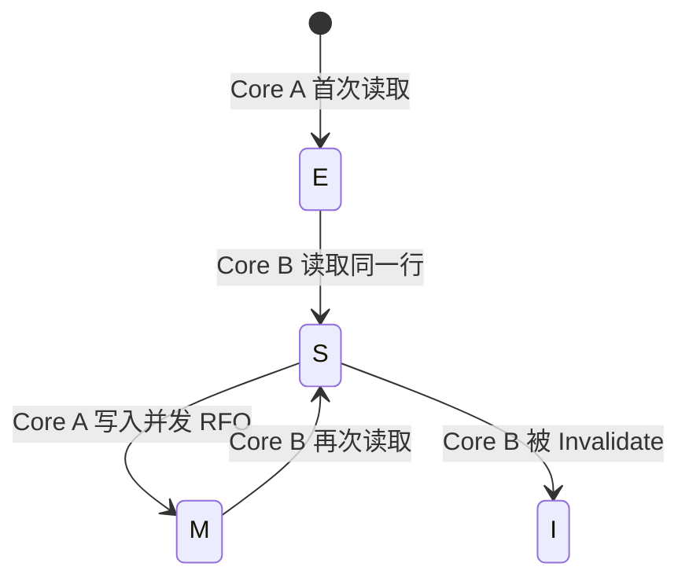
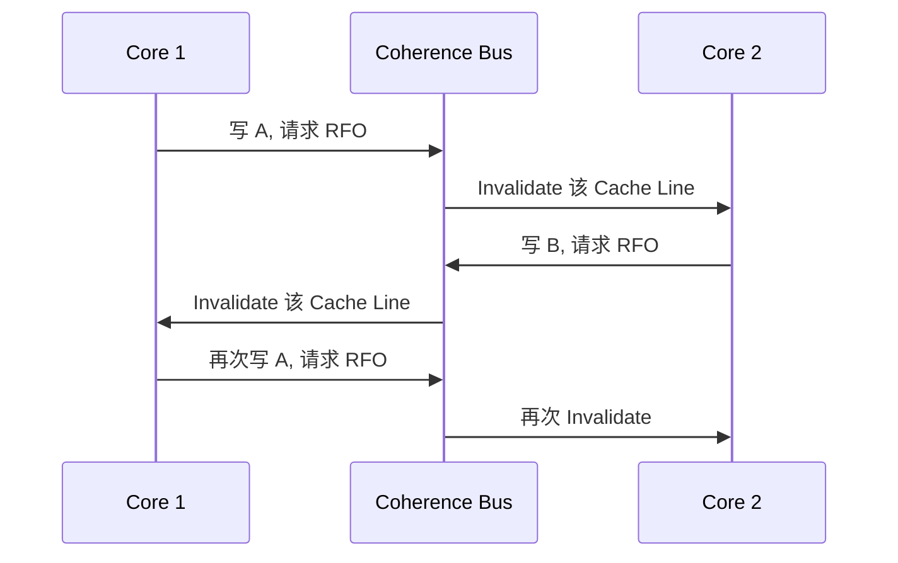
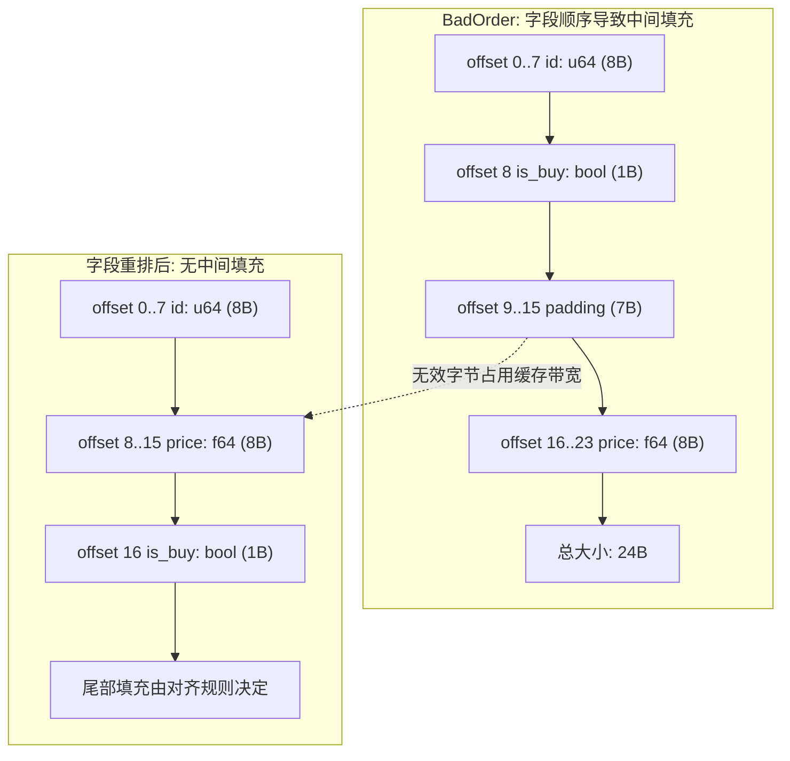
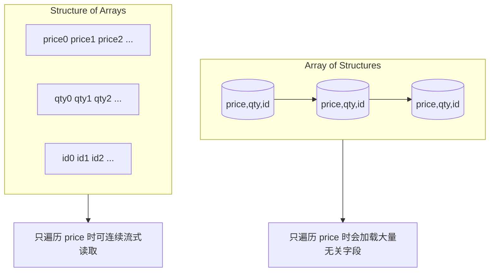

# 内存布局与缓存效率 (Memory Layout & Cache Efficiency)

在低延迟交易系统中，算法复杂度只是性能的一部分，内存访问路径才是更常见的决定因素。现代 CPU 的执行速度远快于主存访问速度，真正限制吞吐和尾延迟的，往往不是算术运算本身，而是数据在缓存层级中的命中率。一次 L1 命中和一次 DRAM 访问之间的数量级差异，会直接放大为处理时延的抖动。这就是为什么在实践中经常出现“代码逻辑没变，延迟分布却明显恶化”的现象：变化的不是业务逻辑，而是内存布局与访问模式。

本章围绕一个核心目标展开：把“缓存友好”从经验口号变成可设计、可验证的工程方法。我们先建立缓存行、缓存一致性、伪共享这些基础模型，再落到 Rust 结构体布局、字段排序、AoS/SoA 选型与大页策略，最后通过基准测试解释为什么某些布局会在 P99 上明显胜出。


上图给出一个简化延迟层级。不同 CPU 具体数值会有差异，但数量级关系基本稳定：越远离核心，访问延迟越高。所谓“缓存友好”，本质上就是把热点访问尽量限制在 L1/L2，并减少不必要的跨层访问。

## 1. 理论背景 (Theory & Context)

### 1.1 缓存行 (Cache Line)
CPU 并不是按字节从内存读取数据，而是按块（Block）读取，这个块称为缓存行。在常见的 x86_64 架构上，缓存行大小通常为 **64 字节**。

这意味着，当你访问结构体的一个字段时，CPU 往往会把该字段所在的整个 64B 区间一起拉入缓存。若后续访问恰好也落在这 64B 内，就能以很低代价完成；若访问模式跨行跳跃，就会持续触发新缓存行加载。所谓空间局部性（Spatial Locality）并不是抽象概念，它对应的就是“每次搬进来的 64B 里，你实际使用了多少”。在热路径上，提升这一利用率通常比微调几条算术指令更有效。

### 1.2 MESI 协议与伪共享 (MESI & False Sharing)

要理解为什么"内存布局决定性能"，必须理解 CPU 核心之间是如何保持缓存一致性的。

#### 1.2.1 MESI 协议
CPU 核心之间通过 **MESI 协议** 来保证缓存一致性。每个 Cache Line (通常 64 字节) 有四种状态：
*   **M (Modified)**: 已修改。脏数据，独占。**这是唯一允许写入的状态。**
*   **E (Exclusive)**: 独占。干净数据，只有我有。
*   **S (Shared)**: 共享。干净数据，大家都有。
*   **I (Invalid)**: 无效。我的数据过期了。

为了把 MESI 与工程现象对应起来，可以看一个最小场景：Core A 首次读取变量 `X`，缓存行进入 E；随后 Core B 也读取 `X`，两边都变为 S；接着 Core A 写入 `X`，必须先通过 RFO（Read For Ownership）使其他核心副本失效，状态提升为 M；若此时 Core B 再读，就需要从 A 或内存重新获得最新数据。这个过程说明了一个关键事实：写入的真实成本不只是“把值写进去”，还包含跨核心一致性协调。多个线程频繁争用同一缓存行时，延迟主因通常是 RFO 与失效广播，而不是原子指令本身。



> **HFT 启示**: 写操作的代价主要来自一致性通信。若多个核心高频写同一缓存行（即便是不同字段），总线会被 RFO/Invalidate 流量占满，系统就会出现典型的 Ping-Pong 抖动。

#### 1.2.2 伪共享 (False Sharing)
这是多核编程中最隐蔽的性能杀手。

伪共享（False Sharing）的典型场景是：变量 `A` 与 `B` 逻辑上彼此独立，但恰好落在同一个 64B 缓存行，线程 1 高频写 `A`，线程 2 高频写 `B`。虽然线程之间并未共享同一个字段，却共享了同一个缓存行所有权，最终导致缓存行在核心间来回迁移。结果是总线流量激增、有效计算时间下降，甚至出现“并行后比单线程更慢”的反常表现。



### 1.3 Rust 中的解决方案：Padding
我们需要通过 **Padding (填充)** 强行把 `A` 和 `B` 隔开，确保它们分别处于不同的 Cache Line。

#### 方案 A: 使用 `#[repr(align(N))]`
```rust
#[repr(align(64))] // 强行对齐到 64 字节边界
struct AlignedCounter {
    value: std::sync::atomic::AtomicU64,
}
// 这样数组中的每个元素都会独占一个 Cache Line
// let counters: [AlignedCounter; 16]; 
```

#### 方案 B: 使用 `crossbeam::utils::CachePadded`
这是社区的标准做法，自动适配不同架构的 Cache Line 大小。

```rust
use crossbeam::utils::CachePadded;
use std::sync::atomic::AtomicU64;

struct SharedState {
    // 读写分离：读者只读 head，写者只写 tail
    // 如果不隔离，写者修改 tail 会导致读者读取 head 变慢（因为在同一 Cache Line）
    head: CachePadded<AtomicU64>,
    tail: CachePadded<AtomicU64>,
}
```

> **HFT 黄金法则**: 永远不要让两个频繁竞争的变量处于同一个 Cache Line。特别是 SPSC 队列的 `head` 和 `tail` 指针，必须隔离。

## 2. 核心实现：控制结构体布局 (Struct Layout)

Rust 默认不承诺源代码中的字段顺序（除非显式指定 `repr`），编译器会基于对齐规则重排或插入填充。多数业务开发中这不是问题，但在低延迟系统里，字段布局直接影响缓存密度、跨行概率与伪共享风险，因此我们需要把“结构体怎么排”当作性能设计的一部分。



### 2.1 填充与对齐 (Padding & Alignment)

为了避免跨越缓存行边界（这会导致两次内存访问），我们需要对关键数据结构进行对齐。

```rust
use std::mem;

// 假设我们有一个高频更新的计数器
// 为了避免 False Sharing，我们强制将其对齐到 64 字节
#[repr(align(64))]
struct AlignedCounter {
    value: u64,
}

// 验证对齐
fn check_alignment() {
    assert_eq!(mem::align_of::<AlignedCounter>(), 64);
    assert_eq!(mem::size_of::<AlignedCounter>(), 64); // 8 bytes data + 56 bytes padding
}
```

### 2.2 紧凑布局 (Compact Layout)
对于大量的只读数据（如历史行情），我们希望尽可能紧凑，以提高缓存密度。

```rust
// 不良布局：包含大量 padding
struct BadOrder {
    id: u64,        // 8 bytes
    is_buy: bool,   // 1 byte
    // padding: 7 bytes
    price: f64,     // 8 bytes
}

// 紧凑布局
#[repr(packed)] // 警告：直接访问 packed 字段引用是 unsafe 的
struct PackedOrder {
    id: u64,
    price: f64,
    is_buy: bool,
}
```

`#[repr(packed)]` 适合“存储或协议格式优先”的场景，例如二进制协议解析、冷数据归档；这些场景的主要目标是字节级紧凑，而非高频随机访问。对热路径计算而言，packed 往往得不偿失，因为未对齐访问可能跨缓存行，带来额外访存成本。涉及原子类型时风险更高，原子读写对对齐有严格要求，错误使用会造成运行时异常或未定义行为。

> **最佳实践**: 在 HFT 热路径中，优先通过字段重排减少 padding，而不是依赖 `packed`。前者通常同时满足“紧凑 + 对齐 + 可维护”。

### 2.3 数组结构 vs 结构数组 (SoA vs AoS)

- **AoS (Array of Structures)**: `[Order; N]`。符合直觉，但在只访问部分字段（如只遍历价格计算均价）时，缓存利用率低。
- **SoA (Structure of Arrays)**: `struct Orders { prices: [f64; N], ids: [u64; N] }`。SIMD 友好，缓存利用率高。



```rust
// SoA 示例：高性能订单簿快照
struct OrderBookSoA {
    prices: Vec<f64>,
    quantities: Vec<u32>,
    ids: Vec<u64>,
}

impl OrderBookSoA {
    // 极度缓存友好，且易于自动向量化 (SIMD)
    fn average_price(&self) -> f64 {
        let sum: f64 = self.prices.iter().sum();
        sum / self.prices.len() as f64
    }
}
```

## 3. 性能分析 (Performance Analysis)

我们通过基准测试来验证缓存友好的 SoA 布局与普通 AoS 布局在遍历求和操作上的性能差异。

### 3.1 基准测试代码

```rust
use criterion::{black_box, criterion_group, criterion_main, Criterion};

struct OrderAoS {
    price: f64,
    qty: u32,
    id: u64,
    padding: [u8; 40], // 模拟大结构体
}

struct OrderSoA {
    prices: Vec<f64>,
    qtys: Vec<u32>,
    ids: Vec<u64>,
}

fn bench_memory_layout(c: &mut Criterion) {
    let size = 1_000_000;
    
    // Setup AoS
    let aos: Vec<OrderAoS> = (0..size).map(|i| OrderAoS {
        price: i as f64,
        qty: i as u32,
        id: i as u64,
        padding: [0; 40],
    }).collect();

    // Setup SoA
    let soa = OrderSoA {
        prices: (0..size).map(|i| i as f64).collect(),
        qtys: (0..size).map(|i| i as u32).collect(),
        ids: (0..size).map(|i| i as u64).collect(),
    };

    let mut group = c.benchmark_group("Memory Layout");
    
    group.bench_function("AoS Sum", |b| b.iter(|| {
        // Cache Miss 严重：每次读取 price 都要跳过 56 字节的无关数据
        aos.iter().map(|o| o.price).sum::<f64>()
    }));

    group.bench_function("SoA Sum", |b| b.iter(|| {
        // Cache Hit 极高：连续读取 f64，预取器（Prefetcher）工作完美
        soa.prices.iter().sum::<f64>()
    }));
    
    group.finish();
}
```

### 3.2 预期结果

在典型桌面/服务器 CPU 上，这类测试通常会出现显著差距，SoA 往往快于 AoS。核心原因是有效带宽利用率不同：若 AoS 每个元素里只有 `price` 被使用，而其余字段在该计算中无关，那么一次 64B 加载可能只消费 8B 有效数据；而 SoA 可以把同类字段连续存放，使一次缓存行加载几乎都用于当前计算。这个差异在大数据量顺序扫描时会直接放大为吞吐差异。

### 3.3 硬件预取器 (Hardware Prefetcher)

SoA 的胜利不仅仅是因为数据密度。**硬件预取器** 是关键。

CPU 有专门的电路来检测内存访问模式。当你按顺序访问 `prices[0], prices[1], prices[2]...` 时，预取器会立刻识别出这个线性模式，并提前将 `prices[3], prices[4]...` 从主存拉取到 L1 Cache。

- **SoA**: 完美的线性访问。预取器工作效率 100%。
- **AoS**: 跳跃式访问 (`addr`, `addr+56`, `addr+112`...)。虽然现代预取器也能识别步长（Stride Prefetcher），但效率远不如纯线性访问高，且浪费了宝贵的内存带宽加载无用的 padding。

## 4. 高级话题：Huge Pages 与 TLB (Translation Lookaside Buffer)

在极度优化的 HFT 系统中，除了 CPU 缓存 (L1/L2/L3)，还有一个经常被忽视的瓶颈：**TLB**。

### 4.1 什么是 TLB？

CPU 使用虚拟地址，而内存使用物理地址。每次访问内存，CPU 都需要查表（页表）进行转换。为了加速这个过程，CPU 有一个专门的缓存叫 TLB。

- **默认页大小**: Linux 默认使用 **4KB** 的页。
- **TLB 容量**: 典型的 L1 TLB 只有 64 个条目（指令）和 100 个条目（数据）。L2 TLB 可能有 1500 个。

**问题**: 如果你的程序频繁访问 1GB 的随机内存，你需要 $1GB / 4KB = 262,144$ 个页表项。TLB 根本装不下。结果是每次内存访问都会触发 **TLB Miss**，导致额外的内存延迟（通常几十纳秒）。

### 4.2 Huge Pages (大页)

解决方案是使用 **Huge Pages**。在 x86_64 上，标准大页是 **2MB**（还有 1GB 的巨型页）。

- **4KB 页**: 覆盖 2MB 内存需要 512 个 TLB 条目。
- **2MB 页**: 覆盖 2MB 内存只需要 **1 个 TLB 条目**。

这极大提高了 TLB 命中率。

### 4.3 实战：在 Rust 中使用 `mmap` 分配大页

要使用大页，通常需要两个步骤：系统配置和代码实现。

#### 步骤 1: 操作系统配置 (System Configuration)

你必须先告诉 Linux 内核预留一部分物理内存作为大页。否则 `mmap` 会失败。

```bash
# 查看当前大页情况
cat /proc/sys/vm/nr_hugepages

# 预留 128 个 2MB 大页（共 256MB 内存）
# 这部分内存会被立即锁定，普通程序无法使用
sudo sysctl -w vm.nr_hugepages=128
```

#### 步骤 2: Rust 代码实现

我们可以使用 `libc` crate 直接调用 `mmap`。

```rust
use std::ptr;
use std::slice;

fn allocate_huge_page() {
    // 2MB 是 x86_64 上默认的大页大小
    const HUGE_PAGE_SIZE: usize = 2 * 1024 * 1024;
    let len = HUGE_PAGE_SIZE;

    unsafe {
        // MAP_HUGETLB (0x40000) 告诉内核我们要大页
        // 注意：如果系统没有预留大页，这里会返回 MAP_FAILED (通常是 ENOMEM)
        let ptr = libc::mmap(
            ptr::null_mut(),
            len,
            libc::PROT_READ | libc::PROT_WRITE,
            libc::MAP_PRIVATE | libc::MAP_ANONYMOUS | libc::MAP_HUGETLB,
            -1,
            0,
        );

        if ptr == libc::MAP_FAILED {
            panic!("mmap failed! Did you run 'sudo sysctl -w vm.nr_hugepages=128'?");
        }

        println!("Successfully allocated 2MB huge page at: {:p}", ptr);

        // 使用 slice 访问这块内存
        let data = slice::from_raw_parts_mut(ptr as *mut u8, len);
        
        // 触发缺页中断 (Page Fault)，内核真正分配物理页
        data[0] = 1; 
        data[len - 1] = 255;

        // 释放内存
        // 注意：在 HFT 生产环境中，通常在程序启动时一次性分配所有内存并常驻，
        // 只有在程序退出或重加载配置时才释放。
        libc::munmap(ptr, len);
    }
}

### 4.4 Rust 风格的 RAII 封装

为了避免手动管理内存导致泄漏，我们应该利用 Rust 的 `Drop` trait 来自动管理大页的生命周期。

```rust
struct HugePageBuffer {
    ptr: *mut u8,
    len: usize,
}

impl HugePageBuffer {
    fn new(size: usize) -> Self {
        // ... mmap implementation ...
        // 略，参考上文 allocate_huge_page 实现
        unsafe {
             let ptr = libc::mmap(
                ptr::null_mut(),
                size,
                libc::PROT_READ | libc::PROT_WRITE,
                libc::MAP_PRIVATE | libc::MAP_ANONYMOUS | libc::MAP_HUGETLB,
                -1,
                0,
            );
            if ptr == libc::MAP_FAILED {
                panic!("HugePage allocation failed");
            }
            HugePageBuffer { ptr: ptr as *mut u8, len: size }
        }
    }
    
    fn as_slice_mut(&mut self) -> &mut [u8] {
        unsafe { std::slice::from_raw_parts_mut(self.ptr, self.len) }
    }
}

impl Drop for HugePageBuffer {
    fn drop(&mut self) {
        unsafe {
            // 当结构体离开作用域时，自动归还大页给操作系统
            libc::munmap(self.ptr as *mut _, self.len);
        }
    }
}
```

> **注意**: 在生产环境中，我们通常使用 `HugeTLB` 文件系统或者透明大页 (THP)。但对于延迟敏感的 HFT，**显式分配 (Explicit Allocation)** 是最可控的。

## 5. 常见陷阱 (Pitfalls)

实践中最常见的问题不是“不知道优化方向”，而是“在错误位置过度优化”。例如把所有小对象都做 64B 对齐会显著增加内存占用，并压缩缓存可容纳对象数量，最终可能让整体性能下降。对齐策略应只用于确实存在伪共享风险的并发热点结构，而不应扩散到所有类型。

另一个常见误区是把 SoA 当成普适解。SoA 对扫描与向量化很友好，但会增加插入、删除、重排等操作复杂度，影响代码可维护性。正确做法是先通过 profiling 确认热点，再对热点数据通路做布局改造，而不是全局替换。

最后，即使采用了 SoA，也不代表编译器一定能完成自动向量化。循环体中的分支、复杂依赖和不可预测访问模式都会削弱向量化收益。工程上应把“布局优化”和“循环结构优化”一起考虑，才能稳定获得可复现收益。

## 5. 延伸阅读

- [CPU Caches and Why You Care](https://www.youtube.com/watch?v=WDIkqP4JbkE) - Scott Meyers 的经典演讲。
- [What Every Programmer Should Know About Memory](https://people.freebsd.org/~lstewart/articles/cpumemory.pdf) - Ulrich Drepper 的必读论文。

---
下一章：[零成本抽象 (Zero-Cost Abstractions)](zero_cost.md)
