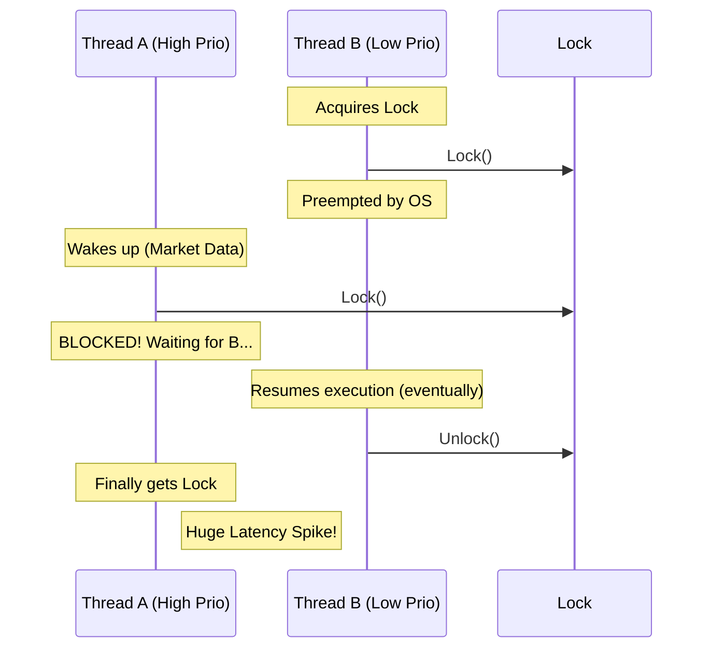

# 无锁数据结构 (Lock-Free Structures)

在普通软件开发中，锁 (`Mutex`, `RwLock`) 是并发控制的基石。但在高频交易 (HFT) 系统中，锁是性能的毒药。

## 1. 为什么 HFT 痛恨锁？

### 1.1 优先级反转 (Priority Inversion)

假设你有两个线程：
- **线程 A (高优先级)**: 处理行情数据，延迟要求极高。
- **线程 B (低优先级)**: 处理日志记录，延迟要求宽松。

如果 B 持有了一个锁（例如日志缓冲区的锁），此时 OS 调度器决定暂停 B（因为它优先级低）。接着 A 运行，试图获取同一个锁。A 将被阻塞，直到 OS 重新调度 B 并让 B 释放锁。



结果：**高优先级的 A 被低优先级的 B 拖慢了**。在极端情况下，这可能导致数百微秒的延迟抖动。

### 1.2 死锁与活锁 (Deadlock & Livelock)
虽然 Rust 的 `Mutex` 能防止数据竞争，但它不能防止逻辑死锁。在复杂的交易系统中，避免死锁的心智负担极重。

### 1.3 缓存行争用 (Cache Line Contention)
锁本质上是一个共享的原子变量。当多个核心争抢这个变量时，会导致严重的 Cache Line bouncing（缓存行在核心间跳来跳去），大幅降低吞吐量。

## 2. 什么是无锁 (Lock-Free)？

"无锁" 并不意味着没有同步，而是指**系统作为一个整体，总是在前进**。

> **定义**: 如果一个线程被挂起，其他线程仍然可以继续执行并取得进展，那么这个算法就是无锁的。

```mermaid
graph TD
    subgraph Lock-Based
        T1[Thread 1] -- Waiting for Lock --> T2[Thread 2 (Holder)]
        T2 -- Descheduled --> Stall[System Stalled]
    end
    
    subgraph Lock-Free
        LF1[Thread 1] -- CAS Failed --> Retry[Retry Loop]
        LF2[Thread 2] -- CAS Success --> Progress[System Progress]
    end
    
    style Stall fill:#f99,stroke:#333
    style Progress fill:#dfd,stroke:#333
```

还有一个更强的保证叫 **无等待 (Wait-Free)**：任何操作都能在有限步数内完成，无论其他线程在做什么。HFT 追求的是 Wait-Free，但在实践中，我们通常满足于 Lock-Free。

## 3. 核心工具：原子操作 (Atomics)

Rust 通过 `std::sync::atomic` 提供了对 CPU 原子指令的直接访问。最著名的就是 **CAS (Compare-and-Swap)**。

### 3.1 CAS 循环模式
这是无锁编程中最常见的模式：

```rust
use std::sync::atomic::{AtomicU64, Ordering};

fn add_to_atomic(atomic: &AtomicU64, val: u64) {
    let mut current = atomic.load(Ordering::Relaxed);
    loop {
        let new_val = current + val;
        // 尝试更新：如果当前值仍等于 current，则设为 new_val
        // 否则返回当前的最新值（Err 中包含最新值）
        match atomic.compare_exchange(
            current, 
            new_val, 
            Ordering::Acquire, // 成功时的内存屏障
            Ordering::Relaxed  // 失败时的内存屏障
        ) {
            Ok(_) => break, // 更新成功
            Err(v) => current = v, // 更新失败，重试
        }
    }
}
```

### 3.2 内存顺序 (Memory Ordering)
这是无锁编程中最难的部分。Rust 提供了 5 种顺序：
- `Relaxed`: 只保证原子性，不保证顺序。最快。
- `Acquire` / `Release`: 用于构建临界区。`Release` 之前的写操作对 `Acquire` 之后的读操作可见。
- `AcqRel`: 同时包含上述两者。
- `SeqCst`: 全局顺序一致。最慢。

在 HFT 中，我们通常使用 `Acquire` / `Release` 来同步数据，使用 `Relaxed` 来处理单纯的计数器。

## 4. 常见陷阱：ABA 问题

假设你实现了一个无锁栈 (Stack)。
1.  栈顶是 A，下面是 B。
2.  线程 1 准备 Pop A。它读取到 Top = A，Next = B。
3.  **线程 1 被挂起**。
4.  线程 2 Pop A，Pop B。栈空了。
5.  线程 2 Push A。
6.  **线程 1 恢复**。它再次检查 Top，发现还是 A（虽然是新 Push 进去的 A，但在内存地址上可能一样）。
7.  线程 1 执行 CAS，将 Top 设为 B。
8.  **灾难发生**: B 已经被释放了，甚至可能已经被重用为其他对象。

### 解决办法
1.  **版本号 (Versioning)**: 将指针和版本号打包在一起（如 `AtomicU128` 或 `Tagged Pointer`）。每次修改版本号 +1。
2.  **内存回收策略 (Reclamation)**:
    - **Epoch-based Reclamation (EBR)**: 只有当所有线程都离开了当前的“纪元”，才真正释放内存。（Rust 库 `crossbeam-epoch` 就用了这个）。
    - **Hazard Pointers**: 线程声明自己正在访问某个指针，其他线程即使要删也不能删。

在 HFT 中，我们通常通过**预分配 (Pre-allocation)** 和 **对象池 (Object Pool)** 来彻底避免运行时的内存分配和释放，从而绕过复杂的 ABA 问题。Ring Buffer 就是这种思想的极致体现。

---
下一章：[Ring Buffer 实现](ring_buffer.md) - 我们将动手实现一个高性能的无锁环形缓冲区。
