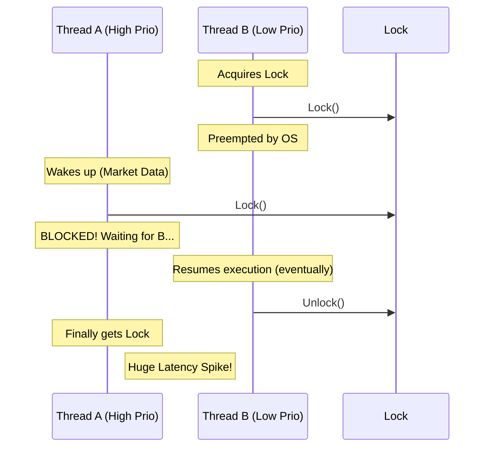

# 无锁数据结构 (Lock-Free Structures)

在普通软件开发中，锁 (`Mutex`, `RwLock`) 是并发控制的基石。但在高频交易 (HFT) 系统中，锁是性能的毒药。

## 1. 为什么 HFT 痛恨锁？

### 1.1 优先级反转 (Priority Inversion)

假设你有两个线程：
- **线程 A (高优先级)**: 处理行情数据，延迟要求极高。
- **线程 B (低优先级)**: 处理日志记录，延迟要求宽松。

如果 B 持有了一个锁（例如日志缓冲区的锁），此时 OS 调度器决定暂停 B（因为它优先级低）。接着 A 运行，试图获取同一个锁。A 将被阻塞，直到 OS 重新调度 B 并让 B 释放锁。


```mermaid
sequenceDiagram
    participant A as Thread A (High Prio)
    participant B as Thread B (Low Prio)
    participant L as Lock
    
    Note over B: Acquires Lock
    B->>L: Lock()
    Note over B: Preempted by OS
    
    Note over A: Wakes up (Market Data)
    A->>L: Lock()
    Note over A: BLOCKED! Waiting for B...
    
    Note over B: Resumes execution (eventually)
    B->>L: Unlock()
    
    Note over A: Finally gets Lock
    Note right of A: Huge Latency Spike!
```

结果：**高优先级的 A 被低优先级的 B 拖慢了**。在极端情况下，这可能导致数百微秒的延迟抖动。

> **思考：无锁就能完全避免延迟吗？**
>
> 答案是：**能避免"优先级反转"导致的死锁和挂起，但不能完全消除延迟抖动。**
>
> 1.  **避免了挂起**: 无锁算法保证线程永远不会因为等待锁而被 OS 挂起。
> 2.  **引入了"活锁"风险 (The Cost of CAS)**: 
>     无锁算法的核心是 **CAS (Compare-And-Swap, 比较并交换)**。
>     *   **原理**: 线程读取变量当前值 `A`，计算新值 `B`，然后告诉 CPU："如果内存里还是 `A`，就把它改成 `B`；否则告诉我失败"。
>     *   **场景**: 如果 10 个线程同时尝试修改同一个变量，同一时刻只有 1 个能成功，剩下 9 个都会失败。
>     *   **后果**: 失败的 9 个线程必须**重试 (Retry Loop)**。在高竞争下，高优先级线程可能连续失败多次，虽然它没有被 OS 挂起（Sleep），但它在 `while` 循环里空转浪费了 CPU 时间。这就是**无锁带来的特有延迟**（Mutex 的延迟来源是挂起，无锁的延迟来源是重试）。
> 3.  **HFT 的终极方案**: 我们追求的是 **无等待 (Wait-Free)**。例如 **SPSC (Single Producer Single Consumer)** 队列，读写操作在不同的缓存行上，完全独立，没有任何竞争，连 CAS 都不需要。这才是真正的零抖动。

### 1.2 死锁与活锁 (Deadlock & Livelock)

虽然 Rust 的 `Mutex` 能防止数据竞争，但它不能防止逻辑死锁。在复杂的交易系统中，避免死锁的心智负担极重。

*   **死锁 (Deadlock)**: 线程 A 持有锁 1 等锁 2，线程 B 持有锁 2 等锁 1，大家都卡死。
    *   **无锁原理**: **把"互相等待"变成了"互相赛跑"**。
    *   在无锁世界里，没有"持有"这一说。A 和 B 都在尝试修改同一个变量。CPU 硬件保证了同一时刻必然有一个人能 CAS 成功（赢家），另一个人失败重试（输家）。
    *   既然总有一个赢家，系统就总能在前进，永远不会发生"大家都动不了"的情况。
*   **活锁 (Livelock)**: 线程一直在运行，但一直在重试 (CAS 失败)，无法取得进展。
    *   **无锁劣势**: 高竞争下，无锁算法容易退化为活锁。

### 1.3 缓存行争用 (Cache Line Contention)

**误区：无锁 = 无争用**。这是错误的。

锁本质上是一个共享的原子变量。无锁算法中的 `AtomicU64` 也是一个共享的原子变量。当多个核心争抢这个变量时（无论通过 Mutex 还是 CAS），都会导致严重的 **Cache Line Bouncing**（缓存行在核心间跳来跳去），大幅降低吞吐量。

**解决之道**:
1.  **分片 (Sharding)**: 将一个热点计数器拆分为 N 个（每个 CPU 一个），最后求和。
2.  **SPSC (单生产单消费)**: 唯一的 Wait-Free 且无争用的结构。Head 指针只被消费者改，Tail 指针只被生产者改，两者放在不同的 Cache Line 上。


## 2. 什么是无锁 (Lock-Free)？

很多初学者认为 "无锁" 就是 "没有任何同步机制，大家随便跑"，这是完全错误的。无锁不仅有同步，而且通常比有锁更复杂。

### 2.1 直观比喻：悲观 vs 乐观

想象一个会议室里有一块白板，大家都要去写字。

*   **有锁 (Mutex) - 悲观策略**:
    *   会议室门口有一把**唯一的钥匙**。
    *   你想写字，必须先抢到钥匙。
    *   抢到了：进去锁门，慢慢写，写完出来还钥匙。
    *   没抢到：**在门口睡觉 (Sleep/Block)**，直到有人叫醒你。
    *   **风险**: 如果拿钥匙的人在里面睡着了（线程挂起/崩溃），所有人都得在门口死等。

*   **无锁 (Lock-Free) - 乐观策略**:
    *   会议室**没有门**，大家随时都能进。
    *   你想写字，先看一眼白板上现在的数字是 `A`。
    *   你在脑子里计算好新数字 `B`。
    *   你冲上去，对白板说：**"如果现在还是 A，就把它改成 B；如果不是 A（说明被别人改过了），告诉我现在的数字是什么，我重新算。"**
    *   **结果**:
        *   总有人能成功（系统在前进）。
        *   失败的人不需要睡觉，而是**立即重试 (Retry)**。
        *   **优势**: 即使你在里面睡着了，别人照样能改写白板，不会被你卡死。

### 2.2 严谨定义

> **Lock-Free 定义**: 只要还有一个线程在运行，系统整体就能一直取得进展 (System-wide Progress)。它保证了**没有死锁**，且**至少有一个线程能成功**。

### 2.3 无锁解决了什么？没解决什么？

回到开头提到的 HFT 三大痛点，无锁技术到底解决了哪些？

| 痛点 | 锁 (Mutex) | 无锁 (Lock-Free) | 结果 |
| :--- | :--- | :--- | :--- |
| **1. 优先级反转 (挂起)** | **严重**。高优先级线程会被 OS 挂起，等待低优先级线程。 | **完美解决**。线程永远不会被挂起，只会在用户态重试。 | ✅ 胜出 |
| **2. 死锁 (Deadlock)** | **有风险**。需要小心设计锁顺序。 | **完美解决**。没有锁，自然没有死锁。 | ✅ 胜出 |
| **3. 活锁 (Livelock)** | 无 (线程直接睡觉去了)。 | **新风险**。竞争激烈时，线程可能一直在重试，消耗 CPU 却无进展。 | ⚠️ 代价 |
| **4. 缓存行争用 (Contention)** | **严重**。多核争抢同一个内存地址。 | **依然严重**。CAS 本质上还是争抢同一个内存地址，硬件开销一样大。 | ❌ 未解决 |

> **一句话总结**: 
> *   **Mutex (悲观)**: "这块地盘是我的，你们都别动，也不准看，去睡觉等着。" -> **容易被单人卡死整个系统**。
> *   **Lock-Free (乐观)**: "大家都能看，大家都能算。虽然只有一个人能提交成功，但没人会被堵住嘴，也没人会被赶去睡觉。" -> **保证了系统总是在流动**。

**结论**: 
*   无锁消除了**操作系统调度 (OS Scheduling)** 带来的不确定性（解决了最致命的延迟尖峰）。
*   但无锁**没有**消除**硬件物理争用 (Hardware Contention)**。
*   **HFT 的终极方案**: 为了解决第 3 和第 4 点，我们必须更进一步，使用 **无等待 (Wait-Free)** 结构（如 SPSC 队列），彻底消除竞争。

*   **Wait-Free (无等待)**: 比 Lock-Free 更强。它保证**每一个线程**都能在有限步数内完成操作，无论其他线程在做什么。这是 HFT 的终极目标（如 SPSC 队列）。

```mermaid
graph TD
    subgraph Lock-Based [有锁: 悲观]
        T1[线程 1] -- 等待锁 --> T2[线程 2 (持有者)]
        T2 -- 被 OS 挂起 --> Stall[系统停滞 (没人能动)]
    end
    
    subgraph Lock-Free [无锁: 乐观]
        LF1[线程 1] -- CAS 失败 --> Retry[立即重试]
        LF2[线程 2] -- CAS 成功 --> Progress[系统前进了]
        Retry --> LF1
    end
    
    style Stall fill:#f99,stroke:#333
    style Progress fill:#dfd,stroke:#333
```

### 2.4 深入思考：为什么 SPSC 是无争用的？(Why SPSC is Contention-Free?)

这是一个极好的问题。既然生产者必须**读取** `head`（检查队列满没满），消费者必须**写入** `head`（通知我消费完了），这难道不是共享变量吗？为什么说是"无争用"？

答案在于 **MESI 状态的非对称性**：

1.  **生产者 (Core P)**:
    *   **只写 Tail**: 它拥有 `Tail` 的 **M (Modified)** 状态。
    *   **只读 Head**: 它只需要 `Head` 的 **S (Shared)** 状态。

2.  **消费者 (Core C)**:
    *   **只写 Head**: 它拥有 `Head` 的 **M (Modified)** 状态。
    *   **只读 Tail**: 它只需要 `Tail` 的 **S (Shared)** 状态。

**关键点**:
*   虽然生产者要读 `Head`，但它**永远不会去写 Head**。
*   虽然消费者要读 `Tail`，但它**永远不会去写 Tail**。

这意味着：
*   `Head` 的所有权 (Ownership) **永远稳定**在消费者手里。
*   `Tail` 的所有权 (Ownership) **永远稳定**在生产者手里。

**没有所有权争夺 (No Ownership Transfer)**。也就没有昂贵的 **RFO (Read-For-Ownership)** 广播。虽然数据依然需要在核心间传输（更新后的值要同步过去），但这比两个人都想**写**同一个变量（都要抢 M 状态）要便宜得多。

此外，我们还可以通过 **Shadow Head/Tail** 进一步减少这种只读的同步频率（批量更新），这将在 [Ring Buffer](../infrastructure/ring_buffer.md) 章节详细展开。

## 3. 核心工具：原子操作 (Atomics)

Rust 通过 `std::sync::atomic` 提供了对 CPU 原子指令的直接访问。最著名的就是 **CAS (Compare-and-Swap)**。

### 3.1 CAS 循环模式
这是无锁编程中最常见的模式：

```rust
use std::sync::atomic::{AtomicU64, Ordering};

fn add_to_atomic(atomic: &AtomicU64, val: u64) {
    let mut current = atomic.load(Ordering::Relaxed);
    loop {
        let new_val = current + val;
        // 尝试更新：如果当前值仍等于 current，则设为 new_val
        // 否则返回当前的最新值（Err 中包含最新值）
        match atomic.compare_exchange(
            current, 
            new_val, 
            Ordering::Acquire, // 成功时的内存屏障
            Ordering::Relaxed  // 失败时的内存屏障
        ) {
            Ok(_) => break, // 更新成功
            Err(v) => current = v, // 更新失败，重试
        }
    }
}
```

### 3.2 内存顺序 (Memory Ordering)
这是无锁编程中最难的部分。Rust 提供了 5 种顺序：
- `Relaxed`: 只保证原子性，不保证顺序。最快。
- `Acquire` / `Release`: 用于构建临界区。`Release` 之前的写操作对 `Acquire` 之后的读操作可见。
- `AcqRel`: 同时包含上述两者。
- `SeqCst`: 全局顺序一致。最慢。

在 HFT 中，我们通常使用 `Acquire` / `Release` 来同步数据，使用 `Relaxed` 来处理单纯的计数器。

## 4. 常见陷阱：ABA 问题

说实话，**在 HFT 中，ABA 问题通常是一个"伪命题"**。

### 4.1 什么是 ABA？
简单来说：你看到门是关着的（状态 A），你离开了一会儿，回来看到门还是关着的（状态 A）。你以为这期间没人进出，但实际上可能有人进去（B）又出来（A）了。

对于 **CAS 指令** 来说，它只比较值是否相等。如果一个指针的值从 `0x1000` 变成了 `0x2000` 又变回 `0x1000`，CAS 会认为它没变，从而执行了错误的操作。这在实现 **无锁栈 (Lock-Free Stack)** 或 **链表** 时是致命的（可能导致内存被错误释放或重用）。

### 4.2 为什么 HFT 不太关心？
ABA 问题主要发生在 **动态内存分配** 的场景中（节点被释放后又被 malloc 出来，恰好地址一样）。

但在 HFT 中，我们的核心原则是：**Zero Allocation (零分配)**。
1.  我们不使用链表，只使用 **Ring Buffer**（数组）。
2.  我们在启动时预分配所有内存。
3.  我们不释放内存，只循环使用。

**结论**: 如果你不做动态 `malloc/free`，就不太会遇到经典的 ABA 问题。我们在 Ring Buffer 中使用的是 `u64` 递增序列号（Head/Tail），这天然免疫 ABA（因为序列号只会增加，不会回头）。

> **面试指南**: 面试官问 ABA，你可以回答："我知道 ABA 是什么（通过版本号解决），但在我的 HFT 系统设计中，我通过预分配和 Ring Buffer 彻底规避了这个问题，因为我们不允许运行时动态分配节点。" 这会显得你非常专业。

### 4.3 通用解法 (仅作了解)
如果你非要写动态数据结构：
1.  **版本号 (Versioning)**: 将指针和版本号打包在一起（如 `AtomicU128` 或 `Tagged Pointer`）。每次修改版本号 +1。
2.  **内存回收策略 (Reclamation)**:
    - **Epoch-based Reclamation (EBR)**: 只有当所有线程都离开了当前的“纪元”，才真正释放内存。（Rust 库 `crossbeam-epoch` 就用了这个）。
    - **Hazard Pointers**: 线程声明自己正在访问某个指针，其他线程即使要删也不能删。

## 5. 延伸阅读：缓存行争用与伪共享

虽然无锁消除了 OS 调度延迟，但它无法消除硬件层面的 **Cache Line Contention**。特别是 **伪共享 (False Sharing)**，是无锁编程中的隐形杀手。

关于 **MESI 协议**、**伪共享** 以及如何使用 `CachePadded` 进行优化的详细内容，请参考基础篇：
👉 [内存布局与缓存效率 (Memory Layout & Cache Efficiency)](../foundations/memory_layout.md#12-mesi-协议与伪共享-mesi--false-sharing)

---
下一章：[Ring Buffer 实现](ring_buffer.md) - 我们将动手实现一个高性能的无锁环形缓冲区。
