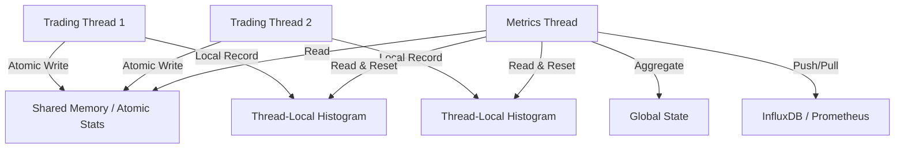

# 指标监控与遥测 (Metrics & Telemetry)

在 HFT 系统中，"You can't improve what you don't measure" 是至理名言。但矛盾的是，**测量本身也会带来延迟**。

传统的监控方案（如 Prometheus Client）通常涉及锁、内存分配和字符串格式化，这在热路径（Hot Path）中是绝对禁止的。我们需要一套专门针对低延迟场景设计的监控系统。

## 1. HFT 监控的核心原则

1.  **零分配 (Zero Allocation)**: 所有的计数器、直方图必须预先分配。
2.  **无锁 (Lock-Free)**: 记录指标时不能争用全局锁。
3.  **极低开销 (Low Overhead)**: 单次记录操作必须在几十纳秒内完成。
4.  **分层架构**:
    *   **热路径**: 仅做原子累加或写入 Thread-local 缓冲区。
    *   **冷路径**: 后台线程负责聚合、格式化和发送。

## 2. 关键指标类型

### 2.1 计数器 (Counter) & 仪表盘 (Gauge)
最简单的指标。使用 `AtomicU64` 即可实现，配合 `Relaxed` 内存序即可满足大部分需求。

```rust
use std::sync::atomic::{AtomicU64, Ordering};

pub struct Metrics {
    pub orders_sent: AtomicU64,
    pub bytes_received: AtomicU64,
}

impl Metrics {
    #[inline(always)]
    pub fn inc_orders(&self) {
        self.orders_sent.fetch_add(1, Ordering::Relaxed);
    }
}
```

### 2.2 延迟直方图 (Latency Histogram)
这是 HFT 中最重要的指标。我们需要知道 P50, P99, P99.9, P99.99 的延迟分布。
标准的 `HdrHistogram` 库非常好用，但它是非线程安全的（为了性能）。

**最佳实践**: 使用 **Thread-Local Histogram**。

每个交易线程维护自己的直方图，后台线程定期轮询并合并所有线程的直方图。

```rust
use hdrhistogram::Histogram;
use std::cell::RefCell;

thread_local! {
    static LATENCY_HIST: RefCell<Histogram<u64>> = RefCell::new(
        Histogram::<u64>::new(3).unwrap()
    );
}

pub fn record_latency(ns: u64) {
    LATENCY_HIST.with(|h| {
        // 记录延迟，开销极小
        h.borrow_mut().record(ns).ok();
    });
}
```

## 3. 遥测架构设计

为了不阻塞交易线程，数据的发送必须异步进行。



### 3.1 实现代码示例

```rust
use std::sync::Arc;
use std::thread;
use std::time::Duration;

pub struct MetricsSystem {
    // 使用 ArcSwap 或 RCU 更新配置
    // 使用 Per-CPU 结构存储直方图
}

impl MetricsSystem {
    pub fn start_background_reporter(&self) {
        thread::spawn(move || {
            loop {
                thread::sleep(Duration::from_secs(1));
                
                // 1. 收集：遍历所有注册的线程局部直方图
                // 注意：这需要一些 unsafe 的技巧或者使用 crossbeam 的 epoch 机制来安全访问其他线程的数据
                // 或者使用消息队列将快照发送出来
                
                // 2. 聚合
                let mut global_hist = Histogram::<u64>::new(3).unwrap();
                // global_hist.add(&thread_hist);
                
                // 3. 报告
                println!("P99 Latency: {} ns", global_hist.value_at_quantile(0.99));
            }
        });
    }
}
```

## 4. 常用性能指标

在 HFT 系统中，除了业务指标（PnL, Position），必须监控以下系统指标：

1.  **Tick-to-Trade Latency**: 从收到行情包到发出订单包的时间差。
2.  **Order-to-Ack Latency**: 发单到收到交易所确认的时间。
3.  **Queue Depth**: 内部 Ring Buffer 的堆积程度（反映处理能力是否饱和）。
4.  **TCP Retransmissions**: 网络质量恶化的先兆。
5.  **Context Switches**: 线程是否被异常抢占。

## 5. 总结

HFT 的监控系统必须是“隐形”的。它不能成为瓶颈。
*   **首选**: Atomic 操作, Thread-Local 数据结构。
*   **避免**: 在热路径中进行 Socket I/O 或 复杂计算。
*   **工具**: `HdrHistogram` 是 Rust 生态中的神器。
