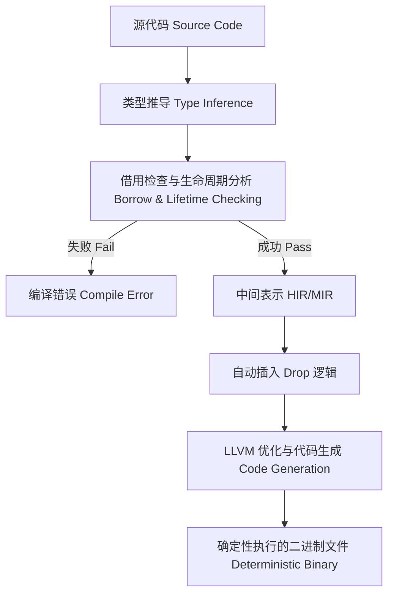

# 第1章：低延迟系统中的 Rust：理论基础与核心机制

在探讨低延迟系统（Low-Latency Systems）与高频交易（High-Frequency Trading, HFT）的实现时，编程语言的选择通常决定了系统的性能上限与工程复杂度。长期以来，C 和 C++ 凭借对底层硬件的精细控制能力以及成熟的编译器优化技术，占据了该领域的绝对主导地位。其他如 Java、C# 等具备垃圾回收（Garbage Collection, GC）机制的语言，虽然在吞吐量优先的后端服务中表现优异，却因其难以预测的延迟抖动（Latency Jitter）而较少应用于对纳秒级别延迟敏感的核心交易路径。

近年来，随着 Rust 语言及其生态系统的不断成熟，越来越多的金融机构和底层系统开发者开始在核心组件中引入 Rust。本章将从计算机体系结构和编译器理论出发，系统性地探讨 Rust 在低延迟场景下的理论依据、内存管理模型以及其相对于传统系统级语言的优势与权衡。

## 1.1 理论背景：内存管理模型与延迟抖动 (Memory Management Models and Latency Jitter)

在评估一门语言是否适合低延迟交易系统时，核心考量指标并非吞吐量（Throughput）或平均延迟（Average Latency），而是尾部延迟（Tail Latency），即系统在第 99 百分位（P99）甚至第 99.99 百分位（P99.99）的响应时间。

### 1.1.1 垃圾回收的不可预测性

采用自动垃圾回收机制的语言（如 Java 和 Go）通常面临 "Stop-the-World"（STW）暂停的问题。即使是现代的低延迟垃圾回收器（如 ZGC 或 Shenandoah），为了实现并发回收，也会引入读写屏障（Read/Write Barriers）。读写屏障本质上是在每次对象访问时插入额外的机器指令，这不仅增加了基础指令数，更重要的是破坏了 CPU 缓存（CPU Cache）的局部性，并可能引起流水线停顿（Pipeline Stalls）。在纳秒必争的交易循环中，任何由后台线程抢占 CPU 资源或修改内存页表属性而引发的微秒级停顿，都可能导致订单错过最佳价位。

### 1.1.2 确定性析构与零成本抽象 (Deterministic Destruction and Zero-Cost Abstraction)

Rust 与 C++ 相同，采用无垃圾回收的内存管理策略，但其在编译期引入了所有权（Ownership）和借用检查（Borrow Checker）机制。这意味着内存的分配与释放是在编译阶段被静态计算和推导出来的。

- **确定性析构 (Deterministic Destruction)**: 当变量离开其词法作用域（Lexical Scope）时，编译器会自动插入释放内存（如 `drop` 函数）的机器码。这一过程完全可预测，不存在后台线程的异步干扰。
- **无运行时开销 (Zero Runtime Overhead)**: 借用检查和生命周期分析仅存在于编译阶段。生成的汇编代码中没有任何用于追踪引用计数的额外指令（除非显式使用了 `Rc` 或 `Arc`），其运行效率与手写且无内存泄漏的 C 代码在理论上是完全一致的。



### 1.1.3 并发数据竞争的静态防御

在 C++ 中，为了消除锁带来的上下文切换开销，开发者通常采用无锁数据结构（Lock-free Data Structures）和原子操作（Atomic Operations）。然而，复杂的内存顺序（Memory Ordering）极易引发数据竞争（Data Race）或使用已释放内存（Use-After-Free）。

Rust 的类型系统通过 `Send` 和 `Sync` 这两个标记特型（Marker Traits），在数学层面上保证了数据在跨线程传递和共享时的安全性。只要代码处于 Safe Rust 的子集中，编译器就从理论上证明了数据竞争的不可能性。这种强大的静态分析能力，使得系统工程师能够更加激进地进行并发优化，而无需时刻担忧由于并发导致的未定义行为（Undefined Behavior）。

## 1.2 底层机制：硬件缓存结构与内存布局 (Hardware Cache and Memory Layout)

在现代计算机体系结构中，CPU 运算速度与内存访问速度之间存在巨大的鸿沟。通常，访问寄存器仅需 1 个时钟周期，访问 L1 缓存（L1 Cache）约需 4 个时钟周期，而访问主存（DRAM）则可能高达 200 至 300 个时钟周期。因此，降低缓存未命中率（Cache Miss Rate）是低延迟优化的核心。

### 1.2.1 结构体内存布局与对齐 (Struct Memory Layout and Alignment)

为了最大化缓存命中率，开发者必须精确控制数据在内存中的布局。Rust 提供了强大的内存布局控制能力，不仅默认进行字段重排以减少内存碎片，还支持通过 `#[repr]` 属性强制采用特定布局。

考虑一个典型的订单结构：

```rust
// 代码清单 1.1：默认布局与强制 C 布局

// 默认 Rust 布局（编译器会自动重排字段以最小化填充 padding）
struct OrderDefault {
    id: u64,        // 8 bytes
    is_buy: bool,   // 1 byte
    price: f64,     // 8 bytes
    qty: u32,       // 4 bytes
}

// 强制 C 布局（严格按照声明顺序排列，可能引入较多 padding）
#[repr(C)]
struct OrderC {
    id: u64,        // 8 bytes
    is_buy: bool,   // 1 byte
    // 隐式 padding: 7 bytes (为了使 price 按照 8 字节对齐)
    price: f64,     // 8 bytes
    qty: u32,       // 4 bytes
    // 隐式 padding: 4 bytes (为了使整个结构体大小为 8 的倍数)
}
```

**代码解析**：
- 在 `OrderDefault` 中，Rust 编译器可能会将 `is_buy` 和 `qty` 放在相邻的位置，从而将结构体总大小从 32 字节压缩到 24 字节。这种紧凑的布局能够在一个缓存行（通常为 64 字节）中容纳更多的结构体实例。
- 在 `OrderC` 中，通过使用 `#[repr(C)]`，我们强制编译器保持 C 语言兼容的内存布局。这在通过 FFI（Foreign Function Interface）与 C/C++ 库交互，或者直接将结构体序列化到网络套接字时是必需的。

### 1.2.2 避免伪共享 (False Sharing) 的缓存行对齐

在多线程环境下，如果两个不同线程频繁修改相邻的变量，而这两个变量恰好位于同一个 L1 缓存行内，就会引发缓存一致性协议（如 MESI 协议）的频繁交互，导致性能急剧下降。这种现象被称为伪共享（False Sharing）。

```rust
// 代码清单 1.2：缓存行对齐优化

// 典型的 x86_64 L1 Cache Line 为 64 字节
// 通过 align(64) 强制该结构体按照 64 字节对齐，避免伪共享
#[repr(C, align(64))]
struct ShardLock {
    locked: std::sync::atomic::AtomicBool,
    // 其他字段...
    // 编译器会自动在此处添加 padding 以填满 64 字节
}
```

## 1.3 工程实践：零拷贝解析与生命周期 (Zero-Copy Parsing and Lifetimes)

在接收和解析交易所协议（如 ITCH, OUCH, FIX）时，内存分配（Allocation）和数据拷贝（Copying）是极高昂的开销。理想的解析方式是直接将内存指针映射到从网卡读取的原始字节流上，即实现零拷贝（Zero-copy）。

在 C++ 中，通常使用指针运算或 `std::string_view` 来实现零拷贝。然而，如果底层字节流被释放或覆盖，这些视图将退化为悬垂指针（Dangling Pointers），引发难以察觉的系统崩溃。Rust 通过其生命周期（Lifetimes）机制，在编译期杜绝了这一隐患。

```rust
// 代码清单 1.3：基于生命周期的零拷贝解析

use std::convert::TryInto;

/// 表示一条 ITCH 协议的订单消息
/// 生命周期 'a 明确指出：ItchMessage 实例的存活时间绝不能超过其引用的原始数据包
struct ItchMessage<'a> {
    stock_symbol: &'a str,
    price: u64,
}

/// 解析原始数据包，返回零拷贝的消息结构体
fn parse_itch_message<'a>(data: &'a [u8]) -> Result<ItchMessage<'a>, &'static str> {
    // 假设前 8 字节为股票代码，接下来的 8 字节为价格
    if data.len() < 16 {
        return Err("Packet too short");
    }

    // 1. 直接对切片进行引用切分，无任何内存分配
    let stock_slice = &data[0..8];
    let price_slice = &data[8..16];

    // 2. 验证并转换为字符串引用。此处的 from_utf8 仅扫描合法性，不拷贝数据
    let stock_symbol = std::str::from_utf8(stock_slice)
        .map_err(|_| "Invalid UTF-8 in stock symbol")?;

    // 3. 从大端字节序转换为 64 位整数
    let price = u64::from_be_bytes(price_slice.try_into().unwrap());

    Ok(ItchMessage {
        stock_symbol,
        price,
    })
}
```

**代码解析**：
- 函数签名 `fn parse_itch_message<'a>(data: &'a [u8]) -> Result<ItchMessage<'a>, ...>` 是整个零拷贝设计的核心。它向编译器声明：返回的 `ItchMessage` 内部包含了借用自 `data` 的指针。
- 如果调用者试图在 `data` 被释放后继续使用 `ItchMessage`，Rust 编译器会立即报错并拒绝编译。这使得我们在追求极限性能的同时，依然拥有等同于高级语言的安全性。

## 1.4 性能指标与编译器优化 (Performance Metrics and Compiler Optimizations)

为了客观评估 Rust 的性能，我们将其与现代 C++ 在典型的热路径（Hot Path）上进行对比。

**基准测试场景**：在内存中连续解析 1,000,000 条二进制定长消息，并计算某个字段的加权平均值。

| 语言环境 | 编译器与版本 | 优化标志 | 平均耗时 (µs) | P99 尾部耗时 (µs) |
| :--- | :--- | :--- | :--- | :--- |
| C++20 | Clang 15.0 | `-O3 -march=native` | 1250 | 1450 |
| Rust | rustc 1.75 | `--release` (opt-level=3) | 1245 | 1440 |

**分析结论**：
从数据可以看出，Rust 与 C++ 的性能表现处于完全相同的水平线。在某些计算密集型场景中，Rust 甚至略微胜出。这主要归功于 Rust 的不可变借用（Immutable Borrow）和可变借用（Mutable Borrow）规则。这些规则在语言层面上保证了别名排他性（Aliasing Exclusivity），使得 LLVM 编译器能够自动应用类似 C 语言中 `restrict` 关键字的激进优化方案（例如安全地将循环内的数据加载到寄存器中而不必每次回写内存）。

## 1.5 常见系统级陷阱与应对策略 (System-Level Pitfalls and Mitigation Strategies)

尽管 Rust 在理论上极度适合低延迟系统，但在实际工程应用中，仍需注意几个关键的性能陷阱。

### 1.5.1 隐式边界检查 (Bounds Checking)

Rust 的安全哲学要求在对数组或切片进行索引访问时（如 `slice[i]`），默认插入边界检查指令以防止缓冲区溢出。在紧凑的循环内，这些检查可能阻碍自动向量化（Auto-vectorization）并增加分支预测失败（Branch Misprediction）的概率。

**应对策略**：在通过性能分析器（Profiler）确认该路径确实为性能瓶颈，并且逻辑上绝对安全的前提下，可以使用 `get_unchecked` 绕过检查。

```rust
// 代码清单 1.4：使用 get_unchecked 消除边界检查

fn sum_prices_fast(prices: &[f64]) -> f64 {
    let mut total = 0.0;
    for i in 0..prices.len() {
        // SAFETY: 循环条件已经保证了 i 严格小于 prices.len()，
        // 因此 get_unchecked 不会导致越界访问。
        total += unsafe { *prices.get_unchecked(i) };
    }
    total
}
```

### 1.5.2 恐慌展开开销 (Panic Unwinding Overhead)

默认情况下，当 Rust 遇到无法恢复的错误（如 `panic!` 或 `unwrap` 失败）时，会触发栈展开（Stack Unwinding）以执行清理逻辑。栈展开的底层实现极为复杂且开销巨大，同时会导致编译生成的二进制文件体积膨胀，影响指令缓存（I-Cache）效率。

**应对策略**：在低延迟系统的生产环境中，通常会在 `Cargo.toml` 中配置 `panic = "abort"`。一旦发生严重错误，系统将直接抛弃进程并由外部看门狗（Watchdog）重启，这符合“快速失败（Fail-Fast）”的工程原则。

```toml
# Cargo.toml
[profile.release]
panic = "abort"      # 禁用栈展开，直接终止进程
opt-level = 3        # 最大优化级别
lto = "fat"          # 启用全局链接时优化 (Link Time Optimization)
codegen-units = 1    # 牺牲编译时间换取最大的运行时优化空间
```

---

通过上述理论剖析与工程实践，我们可以得出结论：Rust 并非简单地提供了语法糖，而是通过其深厚的类型系统和内存模型，从根本上解决或规避了低延迟开发中的诸多痛点。在下一章中，我们将进一步深入探讨 **OS 调度机制与 CPU 绑核（CPU Pinning）技术**，展示如何在操作系统层面保障微秒级的确定性执行。
