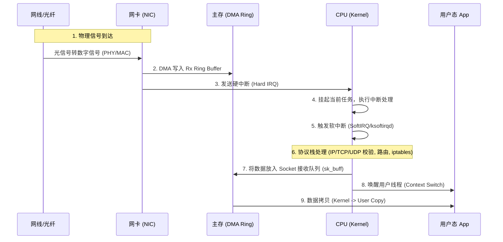
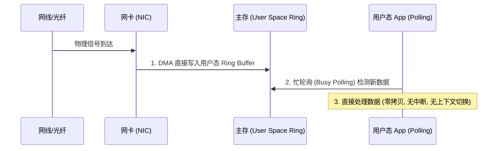
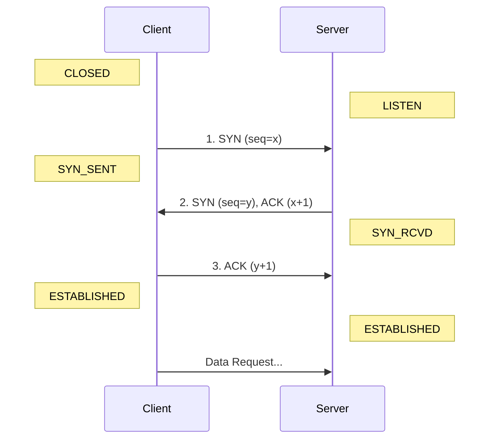
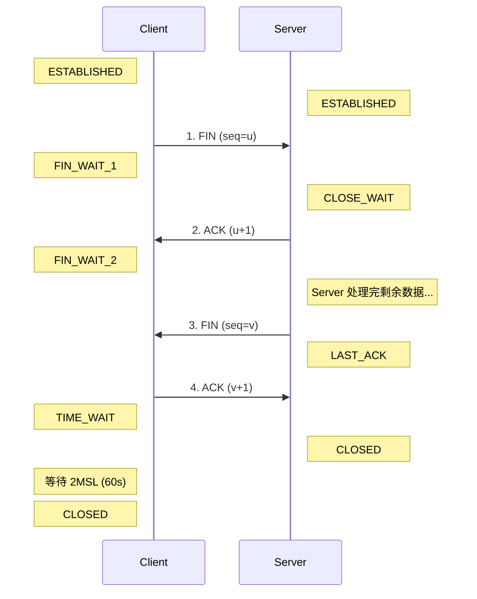
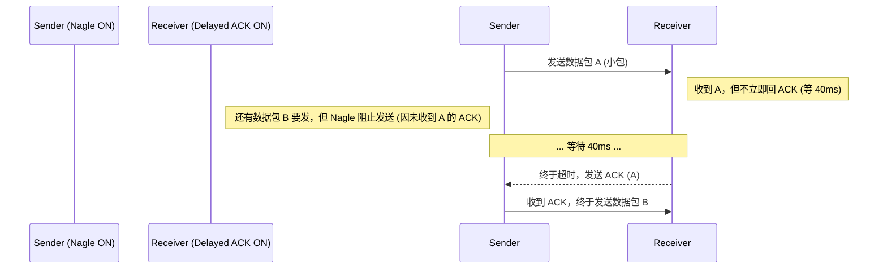
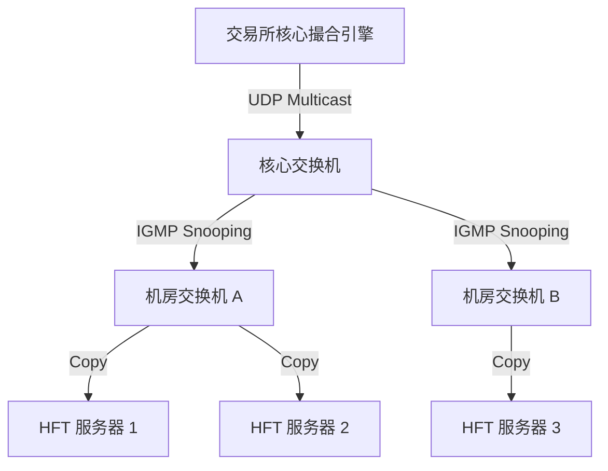
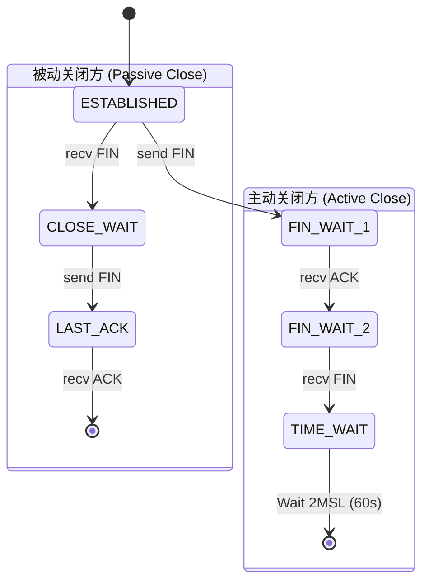

# 网络协议栈基础 (Network Stack Basics)

在高频交易的世界里，网络就是生命线。如果你的代码执行只需 100 纳秒，但网络传输花了 50 微秒，那么你的优化就毫无意义。

本章将深入剖析操作系统网络栈的开销，解释为什么 TCP 在 HFT 中往往是次优选择，以及 UDP 组播（Multicast）为何成为行情数据的标准载体。我们不仅会讨论“怎么做”，还会深入到底层原理，配合图解解释“为什么”。

## 1. 从网卡到用户态：数据的漫长旅程

当一张网卡（NIC）收到一个以太网帧时，它需要经过一系列繁琐的步骤才能到达你的 Rust 程序。理解这个路径是优化的前提。

### 1.1 传统内核路径 (Kernel Path)

在标准的 Linux 网络栈中，数据包的处理流程如下：



**延迟来源分析**：
1.  **中断开销 (Interrupt Overhead)**: 每秒百万级的数据包会触发百万次中断。CPU 需要保存上下文、切换堆栈、执行中断处理程序，这会产生巨大的 jitter（抖动）。
2.  **上下文切换 (Context Switch)**: 当数据准备好后，内核需要唤醒用户线程。调度器（Scheduler）可能不会立即调度你的线程，导致不可预测的延迟。
3.  **内存拷贝 (Memory Copy)**: 数据从内核空间的 `sk_buff` 拷贝到用户空间的 buffer。这不仅消耗 CPU 周期，还会污染 CPU Cache（Cache Pollution），导致后续计算变慢。
4.  **协议栈处理**: Linux 内核协议栈功能强大（防火墙、路由、QoS），但在 HFT 场景下，这些都是多余的开销。

### 1.2 内核旁路 (Kernel Bypass)

为了消除上述开销，HFT 系统广泛采用 **Kernel Bypass** 技术（如 Solarflare OpenOnload, DPDK, AF_XDP）。



**优势**：
*   **零拷贝 (Zero Copy)**: 数据直接 DMA 到用户空间。
*   **无中断 (No Interrupts)**: 使用轮询模式（Polling），CPU 100% 运行在用户态，没有中断打断。
*   **无上下文切换**: 线程独占 CPU 核心 (`isolcpus`)，永远不被调度出去。

## 2. 协议栈解剖：从 Bit 到 Byte (Protocol Deep Dive)

为了深入优化，我们必须了解数据包在网络中传输的真实形态。网络协议是分层的，每一层都有其特定的职责和优化空间。

### 2.0 分层模型概览 (Layered Model)

在 HFT 语境下，我们主要关注 TCP/IP 模型的下四层：

| 层级 | 名称 | 主要协议 | 硬件/软件 | HFT 优化关键点 |
| :--- | :--- | :--- | :--- | :--- |
| **L4** | 传输层 (Transport) | TCP, UDP | OS Kernel / Userspace | Kernel Bypass, 拥塞控制调优, 零拷贝 |
| **L3** | 网络层 (Network) | IP, ICMP | 路由器, OS Kernel | 路由选择, DSCP 优先级, 分片处理 |
| **L2.5**| (粘合层) | **ARP** | OS Kernel | 静态 ARP 绑定 (避免解析延迟) |
| **L2** | 链路层 (Link) | Ethernet, VLAN | 网卡 (NIC), 交换机 | Jumbo Frames, VLAN Offload, 轮询驱动 |
| **L1** | 物理层 (Physical)| - | 网线, 光纤, SFP+ | 低延迟光交换机, 短距离布线 (Twinax) |

### 2.1 链路层 (L2): Ethernet 与 ARP

最外层是 Ethernet II 帧，它是数据链路层的标准。

*   **MAC 地址 (Media Access Control)**: 硬件地址（如 `52:54:00:12:34:56`）。
    *   **HFT 场景**: 在 Co-location 机房内，所有的通信（下单、行情）本质上都是 MAC 地址之间的点对点或组播通信。交换机只看 MAC 地址转发数据，根本不看 IP。
*   **VLAN Tag (802.1Q)**: 许多交易所使用 VLAN 将不同的会员（Members）隔离，或将行情数据与交易数据隔离。如果你的网卡没有正确配置 VLAN Offload 或 stripping，你可能会在接收到的数据包中看到额外的 4 字节 Tag，导致解析错误。

#### ARP: 地址解析协议 (Address Resolution Protocol)
你问到的 ARP，正是连接 L2 (MAC) 和 L3 (IP) 的桥梁。
*   **原理**: 当你知道对方的 IP (`192.168.1.10`) 但不知道 MAC 时，必须广播一个 ARP Request：“谁是 192.168.1.10？”。拥有该 IP 的机器会回复 ARP Reply：“我是，我的 MAC 是 XX:XX...”。
*   **代价**: 这个过程是**阻塞**的（或者导致首包排队）。在 ARP 表项过期（默认几分钟）后，下一个数据包就会遭遇毫秒级的解析延迟。
*   **优化**: 见后文 [静态 ARP](#52-arp-缓存抖动)。

### 2.2 IP: 路由与服务质量

*   **TTL (Time To Live)**: 防止数据包在网络中无限循环。
*   **Protocol**: 标识上层协议（TCP=6, UDP=17）。
*   **TOS (Type of Service) / DSCP**: 这是一个常被忽视的字段。
    *   **优化**: 某些交易所或 ISP 允许高频交易商通过设置 DSCP 标记（如 EF - Expedited Forwarding）来获得更高优先级的路由转发。检查你的交易网关文档，看是否支持此功能。
*   **DF (Don't Fragment)**: 现在的应用通常设置此标志，禁止中间路由器分片。

### 2.3 TCP: 复杂的精密仪器

TCP 头部通常为 20 字节（不含 Options）。

*   **Flags (标志位)**:
    *   **PSH (Push)**: 告诉接收方“不要缓冲数据，立即交给应用程序”。虽然现代 TCP 栈通常会自动处理，但在某些 Kernel Bypass API 中，显式检查 PSH 标志可以帮助判断是否是一批数据的结尾。
    *   **RST (Reset)**: 当你收到一个 RST 包，意味着连接被对方强制切断了（通常因为端口未监听或防火墙拦截）。在 HFT 中，发送 RST 是比 FIN 更快的断开连接方式。
*   **Window Size**: 告诉对方“我还剩多少接收缓冲区”。如果此值为 0，发送方将停止发送（Zero Window），导致通信暂停。
*   **MSS (Maximum Segment Size)**:
    *   **定义**: MSS 是 TCP 层的概念，指 TCP Payload 的最大长度。
    *   **计算**: `MSS = MTU - IP Header(20) - TCP Header(20)`。
    *   **意义**: 它是连接建立时（SYN 包中）协商的。如果你的 MSS 设置过小，会导致 Header 开销占比过大（带宽浪费）；如果过大，会导致 IP 层分片。
    *   **HFT 建议**: 确保 MSS 与路径 MTU 匹配，避免任何形式的分片。

### 2.4 UDP: 极简主义

UDP 头部只有 8 字节：Source Port, Dest Port, Length, Checksum。

*   **Checksum**: 甚至可以选择禁用（设为 0），进一步减少计算开销（虽然在现代 CPU 上收益微乎其微且有风险，一般不推荐）。
*   **优势**: 相比 TCP 繁杂的状态维护，UDP 就像是一张明信片，发出去就不管了。这正是低延迟所需的特质。

## 3. TCP: 可靠性与延迟的博弈

TCP 的设计目标是**在不可靠的网络上提供可靠的字节流传输**。为了实现这一点，它引入了大量机制，而这些机制在低延迟场景下往往反而是阻碍。

### 3.1 三次握手 (Three-Way Handshake)

TCP 建立连接需要 3 个步骤，这消耗了 1.5 个 RTT (Round Trip Time)。



1.  **SYN**: 客户端发送 SYN 包，告诉服务器“我想连你，我的初始序号是 x”。
2.  **SYN-ACK**: 服务器回复“收到了，我的初始序号是 y，期待你的下一个包是 x+1”。
3.  **ACK**: 客户端回复“收到，连接建立”。

**HFT 影响**:
*   **1.5 RTT 的代价**: 如果你的策略依赖于新建连接（短连接），那么你还没发送订单，就已经输在起跑线上了。在跨洋链路中，这可能是几百毫秒的延迟。
*   **优化**: 必须使用 **长连接 (Keep-Alive)**。在开盘前建立好连接，并维持心跳。

### 3.2 四次挥手 (Four-Way Wave)

断开连接比建立连接更复杂，需要 4 个包，因为 TCP 是**全双工**的（每一方都需要单独关闭自己的发送通道）。



1.  **FIN**: 客户端说“我发完了”。进入 `FIN_WAIT_1`。
2.  **ACK**: 服务器说“知道了”。此时服务器进入 `CLOSE_WAIT`，客户端进入 `FIN_WAIT_2`。**注意：此时服务器可能还有数据要发给客户端，连接处于半关闭状态。**
3.  **FIN**: 服务器发完数据后，也说“我也发完了”。进入 `LAST_ACK`。
4.  **ACK**: 客户端说“好的，再见”。进入 `TIME_WAIT`。

理解这个流程，是理解后文 `TIME_WAIT` 和 `CLOSE_WAIT` 陷阱的前提。

### 3.3 Nagle 算法与 Delayed ACK 的死锁

这是 TCP 性能杀手排行榜第一名。

*   **Nagle 算法**: 为了减少小包（Tinygram）造成的网络拥塞，发送方会缓冲数据，直到凑够一个 MSS 或收到前一个包的 ACK。
*   **Delayed ACK**: 接收方为了减少 ACK 包数量，会延迟回复 ACK（通常 40ms - 200ms），等待随后的数据包一起捎带（Piggyback）。

当二者同时开启时，会发生著名的 **Write-Write-Read 死锁**：



**优化**:
*   **发送端**: 必须设置 `TCP_NODELAY` 选项禁用 Nagle 算法。
*   **接收端**: 可以设置 `TCP_QUICKACK` 强制立即回复 ACK（但在 Linux 上这通常是一次性的，需要每次 recv 后重新设置，或者依赖 OS 调优）。

### 3.3 拥塞控制 (Congestion Control)

TCP 假设丢包意味着网络拥塞，因此会降低发送速率。

*   **慢启动 (Slow Start)**: 连接刚建立时，拥塞窗口 (CWND) 很小（通常是 10 个 MSS）。即使网络带宽很大，TCP 也不敢发快。
    *   **优化**: 增大 `initcwnd`（初始拥塞窗口）。Google 建议设为 10，但在高性能内网，可以设得更大。
*   **丢包重传**: TCP 的重传超时 (RTO) 即使在 Linux 激进优化下，通常也是 **200ms** 起步。
    *   **HFT 现实**: 200ms 后，市场早就变了。对于 HFT，TCP 的重传几乎没有意义，我们更关心的是尽快发现丢包并采取应用层补救（如改单或撤单）。

## 4. UDP: 速度与危险

UDP (User Datagram Protocol) 是无连接、不可靠的协议，但它头部开销小 (8字节 vs TCP 20字节)，且没有复杂的拥塞控制，是**行情数据 (Market Data)** 传输的绝对标准。

### 4.1 组播 (Multicast) 架构

交易所通过组播将一份数据同时分发给所有订阅者，保证公平性。



**关键概念**:
*   **IGMP (Internet Group Management Protocol)**: 你的程序启动时，通过 `IP_ADD_MEMBERSHIP` 告诉交换机：“我想加入这个组”。交换机随后才会把该组的数据转发到你的端口。
*   **IGMP Snooping**: 交换机通过监听 IGMP 包，建立组播转发表。如果没有它，组播包会退化为广播包（Broadcast），淹没整个网络。

### 4.2 丢包与乱序处理

UDP 不保证顺序。你收到的包可能是：`Seq 1, Seq 3, Seq 2`。

**应用层处理策略**:
1.  **序列号检测 (Gap Detection)**: 每个 UDP 包头都包含一个递增的序列号。
2.  **乱序缓冲**: 收到 `Seq 3` 时，如果 `Seq 2` 没到，先不处理，放入缓冲区等待一小会儿。
3.  **丢包判断**: 如果 `Seq 2` 迟迟不到，或者收到了 `Seq 4, 5`，则判定 `Seq 2` 丢失。
4.  **补救措施**:
    *   **忽略**: 如果是旧行情（如 100ms 前的报价），直接丢弃，使用最新的。
    *   **重传请求 (Replay Request)**: 通过 TCP 连接向交易所请求重传丢失的包（通常很慢，只用于恢复状态）。
    *   **快照恢复 (Snapshot)**: 如果丢包太多，直接请求最新的全量快照 (Snapshot)。

### 4.3 内核缓冲区溢出

这是 UDP 丢包最常见的原因。

*   **现象**: 交易所突发推送大量行情（Micro-burst），网卡瞬间收到 1000 个包，但内核缓冲区只能存 500 个。剩下的 500 个直接在内核层面被丢弃，应用层甚至不知道它们来过。
*   **优化**:
    *   增大 OS 全局 UDP 缓冲区限制: `sysctl -w net.core.rmem_max=26214400` (25MB)
    *   代码中设置 Socket 选项: `socket.set_recv_buffer_size(26214400)`

## 5. 链路层与驱动优化 (L2/Driver Optimization)

### 5.1 MTU 与分片 (Fragmentation)

*   **MTU (Maximum Transmission Unit)**: 标准以太网帧最大 1500 字节。
*   **分片危害**: 如果一个 IP 包大小为 4000 字节，它会被切分成 3 个片。
    *   **CPU 开销**: 重组分片需要 CPU 计算。
    *   **可靠性降低**: 只要丢失 1 个分片，整个 4000 字节的包都作废。
*   **Jumbo Frames**: 在内网环境中，将 MTU 设为 9000。这能显著提高吞吐量，减少中断次数（因为同样的数据量，包的数量减少了）。

### 5.2 ARP 缓存抖动

当你的程序试图向网关发送第一个包时，操作系统需要查找网关的 MAC 地址。如果 ARP 缓存过期，OS 会发送 ARP Request 并阻塞等待 ARP Reply。这会造成毫秒级的延迟。

*   **优化**: **静态 ARP (Static ARP)**。在服务器启动脚本中，硬编码网关和关键服务器的 MAC 地址。
    ```bash
    arp -s 192.168.1.1 aa:bb:cc:dd:ee:ff
    ```

### 5.3 网卡卸载 (Offloading) 的双刃剑

现代网卡有很多智能功能（Offloading），旨在降低 CPU 负载，但对延迟不一定友好。

| 功能 | 描述 | HFT 建议 | 原因 |
| :--- | :--- | :--- | :--- |
| **TSO (TCP Segmentation Offload)** | 网卡负责将大块数据切割成 TCP 包 | **关闭** | 可能导致数据在网卡缓冲，增加延迟 |
| **GRO/LRO (Generic Receive Offload)** | 网卡将多个小包合并成一个大包再给 CPU | **关闭** | 破坏了包的实时性，增加了接收延迟 |
| **Checksum Offload** | 网卡计算校验和 | **开启** | 纯硬件加速，无副作用，减轻 CPU 负担 |
| **Interrupt Coalescing** | 网卡积攒一堆包再发中断 | **关闭** | 必须设为 0 (`adaptive-rx off`)，确保每个包即时处理 |

**总结**: 对于吞吐量敏感的应用（如文件下载），Offloading 是好事；对于延迟敏感的应用（HFT），我们要的是“傻快”，不要网卡自作聪明地帮我们缓冲数据。

## 6. HFT 面试核心考点与陷阱 (Advanced Interview Topics)

虽然掌握了上述内容已经可以击败 90% 的面试者，但对于顶级 HFT 公司的面试，你还需要了解以下深水区的内容。

### 6.1 TCP 状态机的幽灵：TIME_WAIT 与 CLOSE_WAIT

这是 TCP 状态机中最容易混淆的两个状态，也是线上事故的高发区。



*   **TIME_WAIT (主动关闭方)**:
    *   **现象**: 当你主动断开连接（如爬虫、短连接客户端），你会进入 TIME_WAIT 状态，并持续 2MSL (通常 60 秒)。
    *   **危害**: 占用五元组（Source IP/Port, Dest IP/Port, Proto）。如果在高并发场景下频繁建立短连接，会导致 **端口耗尽 (Port Exhaustion)**，无法建立新连接。
    *   **HFT 策略**:
        *   首选 **Keep-Alive**，不主动断开。
        *   开启 `tcp_tw_reuse`（允许重用 TIME_WAIT 状态的端口）。注意：`tcp_tw_recycle` 因在 NAT 环境下有 Bug，已被 Linux 内核废弃，**千万别在面试中推荐它**。
*   **CLOSE_WAIT (被动关闭方)**:
    *   **现象**: 对方发了 FIN，你也回了 ACK（内核自动回的），但你的**应用程序没有调用 `close()`**。
    *   **本质**: 这是一个 **Bug**。意味着代码逻辑卡住了（比如死锁、阻塞），没有正确处理 EOF。
    *   **面试回答**: "如果发现大量 CLOSE_WAIT，我会直接去查代码里的 `read() == 0` 分支是否漏了 `close()`，或者是否被锁阻塞了。"

### 6.2 时间同步：PTP vs NTP

在 HFT 中，时间就是金钱。我们需要知道行情到达的精确时间，以便进行回测和监管合规（如 MiFID II 要求 100 微秒精度）。

*   **NTP (Network Time Protocol)**:
    *   精度：毫秒级 (ms)。
    *   适用：普通互联网应用。
    *   HFT 评价：**不可用**。毫秒级的误差对于 HFT 来说就像是用日历来计时。
*   **PTP (Precision Time Protocol, IEEE 1588)**:
    *   精度：微秒甚至亚微秒级 (µs)。
    *   原理：硬件打戳 (Hardware Timestamping)。网卡在收到包的物理时刻直接记录时间戳，消除了操作系统中断和调度带来的抖动。
    *   **HFT 标配**: 所有 HFT 服务器必须通过 PTP 与 GPS 时钟源同步。

### 6.3 交换机模式：Cut-through vs Store-and-forward

面试官可能会问：“你了解交换机的转发模式吗？”

*   **Store-and-forward (存储转发)**:
    *   机制：交换机收完**整个**数据包，校验 CRC (FCS)，确认无误后才转发。
    *   延迟：与包长成正比。一个 1500 字节的包在 10GbE 上需要约 1.2µs 的序列化延迟。
*   **Cut-through (直通转发)**:
    *   机制：交换机只要读到 **目的 MAC 地址** (前 14 字节)，就开始向出口端口转发，不管后面数据是否完整或正确。
    *   延迟：极低且固定（通常 < 300ns），与包长无关。
    *   **HFT 选择**: **必须使用 Cut-through 交换机** (如 Cisco Nexus 3548, Arista 7150)。

### 6.4 进阶 Socket 选项

除了 `TCP_NODELAY`，你还应该知道：

*   **`SO_REUSEPORT`**: 允许多个线程/进程绑定到同一个端口。内核会自动进行负载均衡。这对构建多线程 UDP 接收网关非常有用。
*   **`SO_BUSY_POLL`**: Linux 内核提供的一种折衷方案。在 socket 层进行轮询，减少中断，延迟介于标准中断和 DPDK 之间，但无需重写代码。

