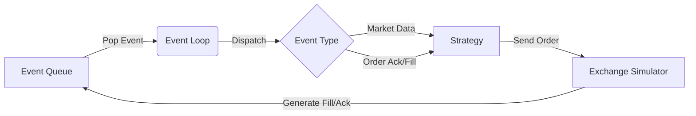

# 事件驱动回测引擎 (Event-Driven Backtesting)

回测（Backtesting）是量化交易的基石。对于 HFT 而言，简单的向量化回测（Vectorized Backtesting，如 Pandas）是远远不够的，因为它们无法模拟延迟、订单队列位置以及市场微观结构（Microstructure）。

我们需要的是一个**事件驱动 (Event-Driven)** 的回测系统，它能够精确模拟真实交易环境中的每一个 tick。

## 1. 核心架构

事件驱动回测的核心思想是：**时间是离散的，系统状态只在事件发生时改变。**



### 1.1 统一的事件定义

为了让策略代码在回测和实盘中完全复用，我们需要抽象出统一的事件接口。

```rust
pub enum Event {
    MarketData(MarketData),
    OrderAck(OrderAck),
    OrderFill(Fill),
    Timer(u64), // 模拟定时器
}

// 这是一个 PriorityQueue，按时间戳排序
pub struct EventQueue {
    queue: BinaryHeap<EventWrapper>,
}

struct EventWrapper {
    timestamp: u64,
    event: Event,
}

// Rust 的 BinaryHeap 是最大堆，我们需要反转 Ord 来实现最小堆（时间最早的在最前）
impl Ord for EventWrapper {
    fn cmp(&self, other: &Self) -> Ordering {
        other.timestamp.cmp(&self.timestamp)
    }
}
```

## 2. 交易所模拟器 (Exchange Simulator)

这是回测引擎中最复杂的部分。它需要模拟交易所的行为，包括：

1.  **撮合逻辑 (Matching Logic)**: 模拟中央限价订单簿 (CLOB)。
2.  **延迟模拟 (Latency Simulation)**: 模拟网络传输延迟和交易所处理延迟。

```rust
pub struct ExchangeSimulator {
    // 模拟的订单簿
    order_book: OrderBook,
    // 延迟模型
    latency_model: Box<dyn LatencyModel>,
    // 待处理的事件队列（指向主事件循环）
    event_queue: Rc<RefCell<EventQueue>>,
}

impl ExchangeContext for ExchangeSimulator {
    fn send_order(&mut self, order: NewOrder) -> Result<OrderId, RejectReason> {
        // 1. 计算延迟
        let now = self.current_time();
        let latency = self.latency_model.next_latency();
        let arrival_time = now + latency;

        // 2. 将订单到达事件推入队列
        // 注意：这里我们模拟的是“订单到达交易所”这个事件，而不是立即成交
        self.schedule_event(arrival_time, InternalEvent::OrderArrival(order));
        
        Ok(order.id) // 立即返回，就像异步发送一样
    }
}
```

### 2.1 延迟模型

HFT 回测必须考虑延迟的随机性（Jitter）。

```rust
trait LatencyModel {
    fn next_latency(&mut self) -> u64;
}

struct ConstantLatency(u64); // 固定延迟，用于基准测试
struct LogNormalLatency { ... } // 对数正态分布，模拟真实网络抖动
```

## 3. 策略代码复用

最关键的一点是：**策略代码不能感知它是在回测还是实盘。**

我们需要通过 Trait 来抽象环境（Context）。

```rust
pub trait Context {
    // 获取当前时间（回测时是模拟时间，实盘时是真实时间）
    fn now(&self) -> u64;
    // 发送订单
    fn send_order(&mut self, order: NewOrder) -> OrderId;
    // 撤单
    fn cancel_order(&mut self, order_id: OrderId);
}

pub struct Strategy<C: Context> {
    ctx: C,
    // ...
}

impl<C: Context> Strategy<C> {
    pub fn on_tick(&mut self, tick: &Tick) {
        if self.signal(tick) {
            self.ctx.send_order(...);
        }
    }
}
```

在回测中，我们注入 `BacktestContext`；在实盘中，我们注入 `LiveContext`。由于使用了泛型（Generics），编译器会为两种情况分别生成优化的机器码（Monomorphization），实现零成本抽象。

## 4. 避免未来函数 (Data Snooping Bias)

在事件驱动架构中，只要严格遵守以下规则，就能从根本上杜绝“偷看未来数据”：

1.  **时间单调递增**: 事件队列中的事件必须严格按时间戳排序。
2.  **因果律**: 只有当前时间之前的事件才能触发当前状态的改变。
3.  **信息隔离**: 策略只能访问 `Context` 提供的信息，不能直接访问全局变量或未来的数据文件。

## 5. 总结

事件驱动回测引擎虽然实现复杂，但它是 HFT 策略开发的必经之路。通过精确模拟延迟、撮合逻辑和微观结构，我们可以在上线前尽可能发现策略的逻辑漏洞和性能瓶颈。Rust 的类型系统和零成本抽象使得我们可以在不牺牲性能的前提下构建这样一套复杂的仿真系统。
